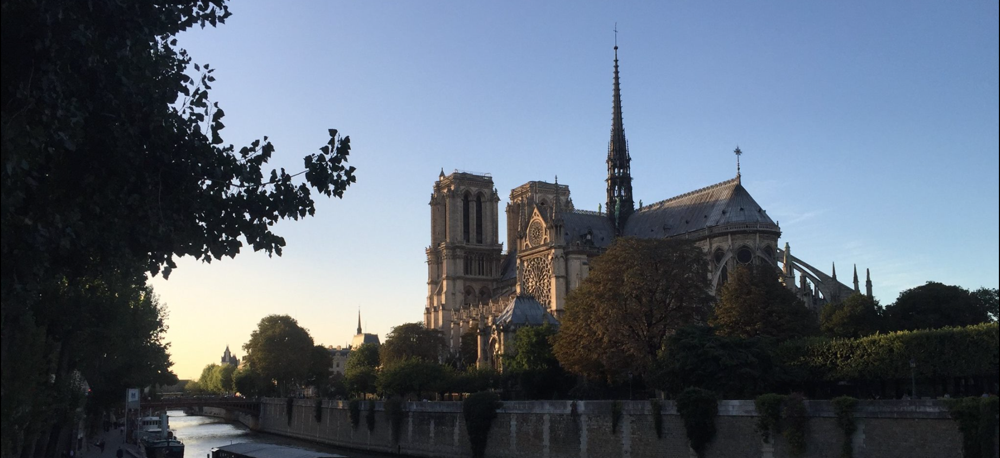 
	
Где лучше жить? Часто, посещая один из этих городов, живя в другом может появиться желание переехать. И поэтому надо хотя бы осмотреть все стороны вопроса. Чтобы вам не наскучило так ка есть люди фактов и люди чувств, выберите какой ответ вы хотите получить: если субъективное мнение автора об обеих столицах, тогда читайте дальше, а если объективное для самостоятельного решения, переходите ниже [нажав сюда](#качество-жизни). 

И так, поехали!

# Образ Жизни #
Ответ на вопрос где бы вам больше понравилось сходиться к тому что вы за человек. Потому что Французы и Немцы очень разные люди и они устроили свои столицы подобающе их характеру и вам легче приживётся если вы хорошо знаете себя.
## Французы ##
Французы - великие экстроверты. Они любят жить напоказ, есть при людях, гулять при людях, одеваться модно для других. "Всё наружу" - это про них. В этом они похожи на своих Латинских родственников: Испанцев и Итальянцев, но в отличие от них, у Французов этот образ жизни ещё и сочетается с практическим успехом: Всё удобно, всё работает. Французам не так важно личное пространство и поэтому [Париж самый плотно населённых город в Европе](https://www.lagrandeconversation.com/en/society/fewer-parisians-but-more-greater-parisians-density-in-the-ile-de-france/#:~:text=The%20density%20of%20Paris%20is,7th%20densest%20in%20the%20world.) и плотнее населён чем Шанхай, Токио и Нью-Йорк. Отсутствие личного пространства особенно ощутимо в квартире, где тебе из окна видны окна соседей и даже слышно как они приходят домой. 

 

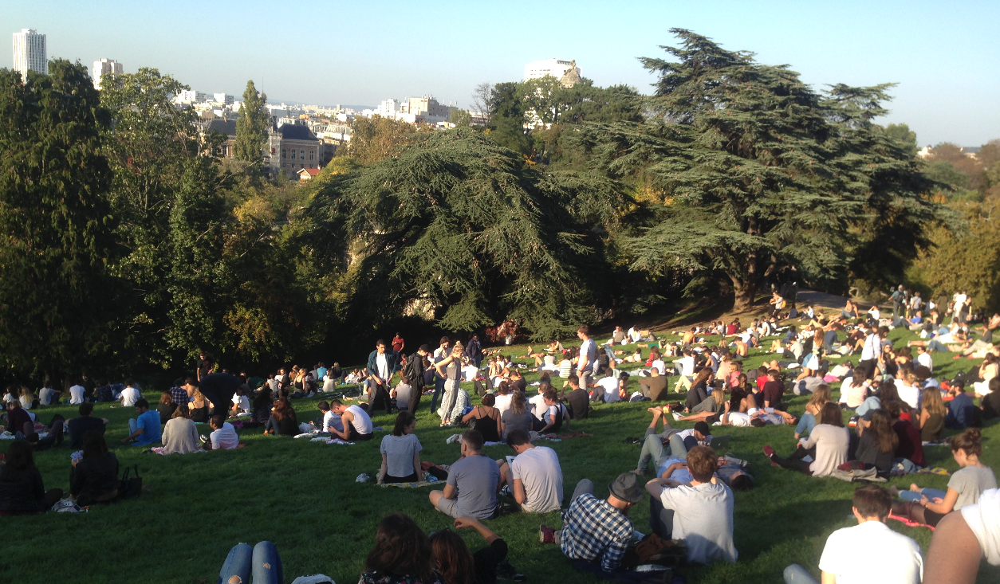 
Квартира для большинства Парижан: место где можно только поспать. Утром они едят завтрак в кафе, днём обедают в булочной, а вечером встречаются с друзьями в ресторанах. И так каждый день. Можно себе представить что такой образ жизни не самый дешёвый, но по другому становится неудобно. Выходя часто *на люди*, Французы так же заботятся быть хорошо одетыми и по одёжке встречают. Тут редко увидишь людей в шлёпанцах или беговой обуви. Шлёпанцы - для пляжа, а беговая обувь - для бега и только. 

В плане национализма: эта одна из редких стран мира где его не стыдятся. Всё Французское: самое лучшее: Вино, сыр, хлеб, музыка, история, кино везде и всегда Французы самые молодцы. Если вы скажете им обратное, то сильно обидите. Они настаивают чтобы даже туристы разговаривали с ними на Французском и часто притворяются что не понимают других языков (Английского например). Им есть чем гордится: особенно красотой своей столицы, равной которой нет во всём мире до сих пор. 


 Особенно для Британских культур они могут показаться грубыми, для Немцев: заносчивыми, но для Русскоязычных они в самый раз, честны и прямолинейны. 
 

Подружиться с Французом займёт долгое время, потому что они как Британцы имеют много знакомых и мало друзей. Но если дать общению достаточное время и быть так же открытым на откровенные темы, в один день вы узнаете что приобрели преданного и хорошего друга который будет готов ради вас на больше чем "желаю вам хорошего настроения". 

## Немцы ##
Немцы: и тут я имею в виду Берлинских Немцев, которые, как и Парижане сильно отличаются от своих нестоличных сограждан, совершенно другой народ. Они ценят личное пространство, задёргивают шторы и ограждаются стенами, если могут себе это позволить. Хотя и Французы и Немцы знамениты тем что не сводят глаз с тебя в публичном транспорте, Французы это делают из любопытства, а Немцы скорее с опаской. Немцы: интроверты, хотя добродушные, простые, и приветливые, всё равно есть чувство, что они входят с тобой в контакт из вежливости и так же вежливо прекращают его и возвращаются в своё уединение. 

Они одеваются практично, в пробковые сандали, пуховики и джинсы, и не стесняются носить лыжные куртки зимой, потому что *Тепло и практично*. Немецкая практичность повсеместна. Хлеб должен храниться долго и не засыхать к вечеру как французский багет. 

Немецкий характер хорошо символизируют Берлинские дома. Здания должны быть квадратной формы, потому что так используется максимальный объём на квадратный метр. Все полы должны быть ровные, а двери в квартирах: одинакового размера и хотя бы метр в ширину. Французы в этом смысле laissez-faire и к дверям, и к кодексу внутреннего ремонта. И за красивым белым Парижским фасадом центрального дома вы найдёте и кривые потолки и косые стены. "Но не зацикливайся на мелочах" скажут они. 

А вот у Немцев красота именно в мелочах. Когда в 2000ом году в Берлине царил очередной бум застройки и капитального ремонта, оказалось что квартиры стали слишком герметичными. Из-за отсутствия щелей открыли что когда не хватает сквозняка, процветает чёрная плесень в доме. Обсудив этот феномен, строители стали добавлять аккуратные окошки в оконных рамах для создания "регулируемых сквознячков" в домах.  

Зато, есть одно исключение Немецкой строгости и порядку: природа. Немцы дают деревьям расти как они хотят и как будто строят свою жизнь вокруг них. Я нигде не видел такой искренней радости природе как у Немцев, когда при первом признаке весны, в дождь и слякоть, жители города молча ходят по большому лесу Tegel и с влагой впитывают скудное Мартовское потепление. Так же в Берлине сохранено много незастроенных районов, где так же люди гуляют в любую погоду:
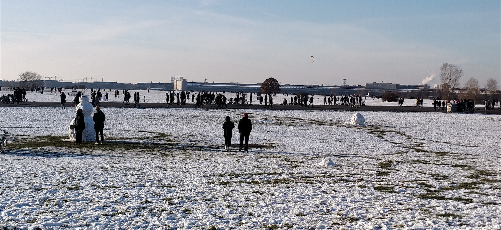 
 
В связи с прогулками в холодном тумане, Немцы так же принципиально за стоицизм и здоровье в отличие от Французов. Они с удовольствием плавают в озерах вокруг Берлина даже когда холодно. Любят зимой ходить в сауну, а потом обливаться ледяной водой. Для них, прогулка часто занимает пол дня и 10 километров. Так же заметно много бегунов и велосипедистов всех возрастов. В еде тоже стоицизм: она выглядит как жирные, солёные калории. Главное чтобы было сытно. В Берлине вполне можно узнать тот же суп, пюре, и тефтели из Советской столовой. 


 На красный свет пешеходы стоят даже если нет машин и объясняют это тем что если вдруг какой-нибудь ребёнок увидит нарушение дорожных правил, это будет нехорошо. Немецкие велосипедисты совсем не смущаются остановить нарушившую машину на ходу и накричать на хозяина что *он подвергает жизни людей опасности*. 


В Париже всё иначе: Пешеходы идут на красный, таксисты и велосипедисты в открытом противостоянии, подрезая друг друга мчатся проскочить на тот же красный свет. Нет настойчивости на праве порядка и само понимание прав порядка относительно. Тут опять же надо вас спросить: а какой у вас характер? Прошли бы вы на красный свет и как бы отреагировали на "нарушителя"? Потому что ответ на этот вопрос диктует не только разницу в дорожной безопасности, но и отношение к кодексам ремонта квартиры, гибкости бюрократии, поведения в общественном транспорте, и многое другое. 

## Культура Города ##
Можно подытожить что если вам не так важно личное пространство, вы живёте ради общения, и вам принципиальна красота и изысканность, то Париж для вас. Если же предпочитаете уединение, природу, и практичность, то вам скорее подойдет Берлин. В обоих городах можно найти культуру, но Париж всё-таки превосходит Берлин в её объёме и качестве. В Париже множество музеев и даже за 4 года не сможете все их обойти. В Париж с гастролями приезжают великие музыканты и есть несколько превосходных концертных залов где их можно услышать. Балет, театр, скульптура, опера, картины знаменитых художников: нет более насыщенного классической культурой города в мире чем Париж. 
Полностью перестроенный во время Наполеона III, в Париже идеально сохранилась та красота прошлого века, которая к сожалению была разрушена войной и погоней за прибылью в других городах (в том числе в Берлине). 
 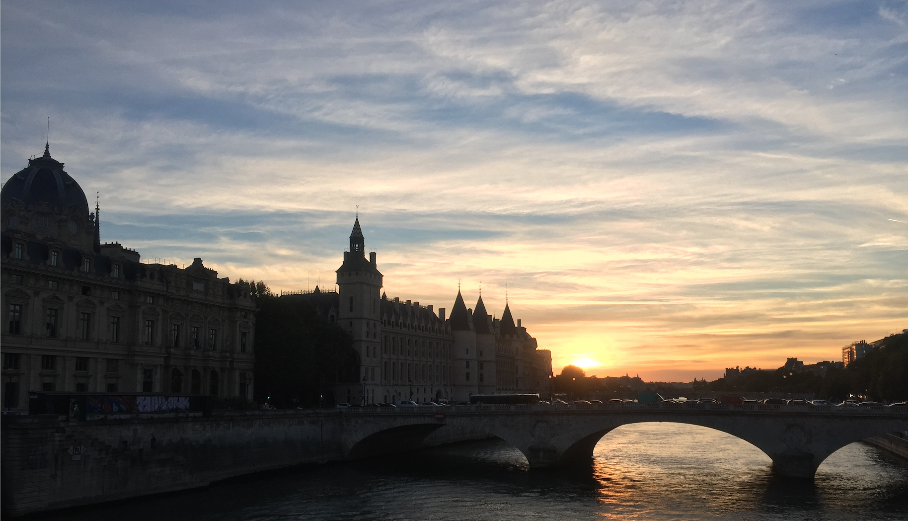 

 Притом, в Париже чувствуется непринуждённая красота на каждом углу, полностью сотворённая рукой человека. Так же греет душу что Париж и через 100 лет останется таким же, потому что Французы ценят его и не дают разрушать и переделывать даже во имя прибыли. Это заметно например когда смотришь Французские фильмы снятые в Париже. И в 1960ом, и в 2000ом, меняются машины, но все улицы совершенно такие же.

  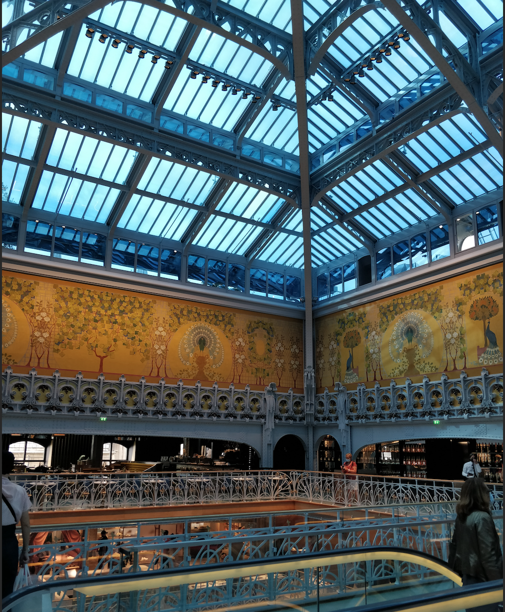

Берлин, с другой стороны, Город с тяжёлой историей, построен (или скорее заново придуман) после Второй Мировой войны. Он был восстановлен как можно быстрее чтобы люди смогли вернуться к нормальному образу жизни. Но всё равно, из-за того что он был запланирован почти с нуля с Немецкой практичностью и с ориентацией на рабочий клас, в нём есть свои прелести. 

Если Париж был сотворён для потехи Bourgeoise, Берлин построен для людей. В городе отлично спланирована инфраструктура общественного транспорта, районы не густо заселены, и всё что нужно для комфорта можно найти в нескольких шагах от любого дома. Да, в нём нет столько мрамора и часто некоторые районы выглядят по Спартански, но в Берлине есть доступный всем уют и тут спокойнее жить. В Берлине не может возникнуть чувство зависти соседу как в Париже ещё и потому что в Немецкой культуре не принято выделяться и кичиться роскошью. Берлин так же зелёный город и гораздо больше напоминает Советские города по планировке и архитектуре. 

Берлин был разделён на две части с 1961-1989, и конечно это ярко выраженно до сих пор. Жители его до сих пор болезненно относятся к этому разделению, и вы почти всегда можете догадаться в каком Берлине вы находитесь. А если забудете, вам напомнят множество памятников посвящённые этому. 
  
В результате в Берлине с одной стороны преобладают Советского типа постройки, своего рода "Хрушёвки", и к удивлению многих памятники Советских времён сохранены в идеальной форме. Например, на Treptower park можно прочитать позолоченные цитаты Сталина:
  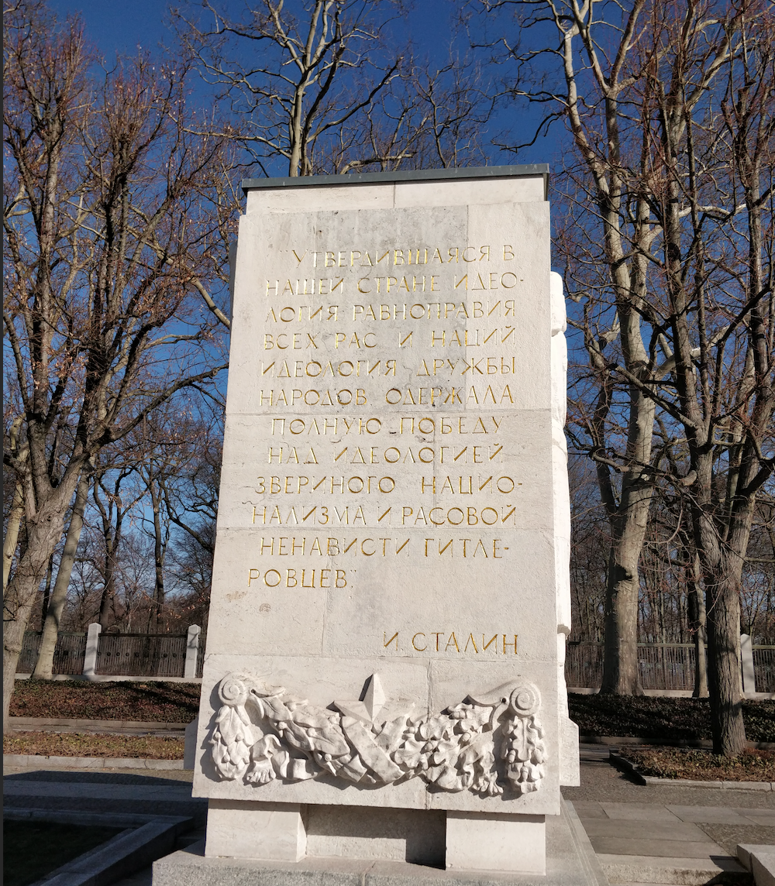

Оба города, Париж и Берлин борются с машинами и тут Париж заметно превосходит Берлин из-за плотности населения, и из-за его прекрасного мэра Anne Hidalgo. Она настолько яростно истребляла автодороги что когда узнала что её могут убрать с поста мэра, встроила в десятке улиц глубокие вертикальные бетонные плиты чтобы дорогу было слишком дорого "вернуть" автотранспорту. В Берлине чувствуешь себя безопасней на велосипеде. Дорожки маркированы, есть светофоры и люди которые им подчиняются. 

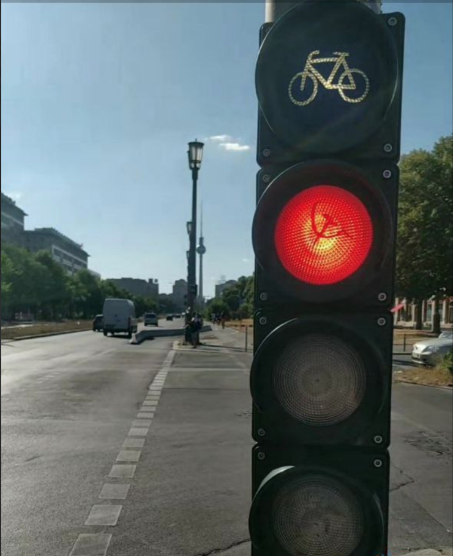

В Париже часто приходится велосипедистам воевать за дорогу с автобусами и такси, с пешеходами которые спокойно идут на красный с вызывающим взглядом, с пешеходами на велосипедных дорожках и велосипедами на пешеходных. Но Французский хаотичный подход к жизни и тут каким-то чудом разруливает ежеминутно два опасных контингента столицы, и с *ta mére!* и *merde* каждый из них улетает по своим делам.

## Культура еды ##
Едой Немцы и Французы отличаются так же резко, как и образом жизни. Французы ценят еду как национальное состояние и относятся к ней как искусству, ритуалу, и источнику наслаждения. Из уважения к еде, рестораны Парижа в основном открыты с 12-2ч и с 19-22ч, на обед и ужин. Пропустив эти два окошка времени когда Французы готовят и едят, чувствуешь себя наказанным ребёнком который не пришёл вовремя домой и остался без ужина. Ваше наказание: есть только кебаб которые в Париже работают круглосуточно и сильно уступают в качестве Берлинским. Все кто связан с Французской кухней: от *Chef*-Повара до официанта, с гордостью блюстят своё возвышенное призвание. Вам никогда не подадут большую порцию, и с насмешкой откажутся подстраиваться к "баловству молодёжи" как Веганизм, Глютен, и диеты без жиров, сахара, или алкоголя. Уж лучше вам отказаться от заказа блюда или пожертвовать своими принципами чем жертвовать неприкосновенной гармонией шедевра Французского повара. 

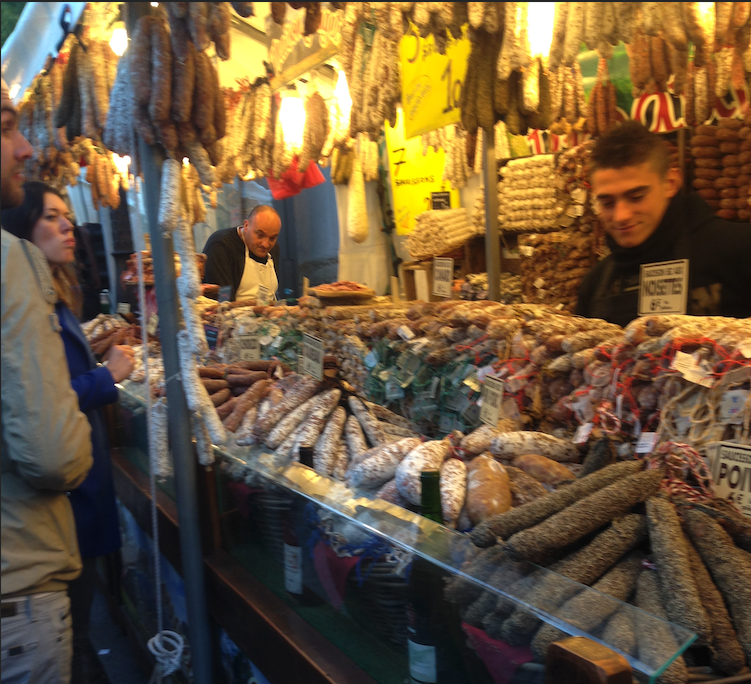

Из-за этого консерватизма и непреклонности к трендам, еда в Париже превосходна. Она неописуемо превосходна ещё и из-за Французского внимания к качеству продуктов.  Повара уважающих себя ресторанов сами ходят на рынки и выбирают ту свежую морковку у фермера которого они знают уже лет 20. Фермеры, соответствуя, выращивают свои продукты с тем же вниманием и это видно по тому с какой любовью и гордостью они раскладывают свои товары на рынке и как рады они объяснить, как и что было выращено. 

Меня поразило насколько Французские Фермеры, Официанты, Виноделы, и вообще люди рабочего Класа отвергли раболепную англо-саксонскую манеру тебе угождать и прислуживать, и ведут себя с достоинством и гордостью в своём отношении к клиенту. "Клиент всегда прав" можете оставить при себе, а лучше: за границей. В хорошем ресторане, вы гость и вам дадут ровно столько уважения сколько вы сами оказываете людям там творящим. В противном случае, над вами могут остро подшутить, могут "забыть" на пару часов, а то и вообще выгнать. 

Вы не только не обязаны, но и часто обидите официанта оставляя чаевые, потому что в отличие от почти всех других стран мира, во Франции у официантов есть и полная зарплата и право на так же оплачиваемый отпуск.

Как Немцы в отношении строительства, у Французов в отношении еды существуют жёсткие стандарты. Французский *baguette* внесён в список ЮНЕСКО как "неприкосновенное достоинство человечества" и закон гласит что *baguette* должен изготавливаться только из воды, муки, дрожжей, и соли, не содержать консервантов и никогда не замораживаться. Он должен быть 5-6 cm диаметром, весить около 250г, и стоить около 1 евро. Французы едят по 30 миллионов *baguette* каждый день ещё и потому что с таким способом приготовления, такой хлеб не продержится больше 12ти часов в свежем виде. 
У Немцев такая же любовь и строгость к пиву. Издан в 1516 году и соблюдающейся до сегодня, в пиве должно быть только три ингредиента: вода, ячмень, и хмель. По моему мнению самое лучшее пиво в мире: Немецкое, а самое лучшее вино: Французское.
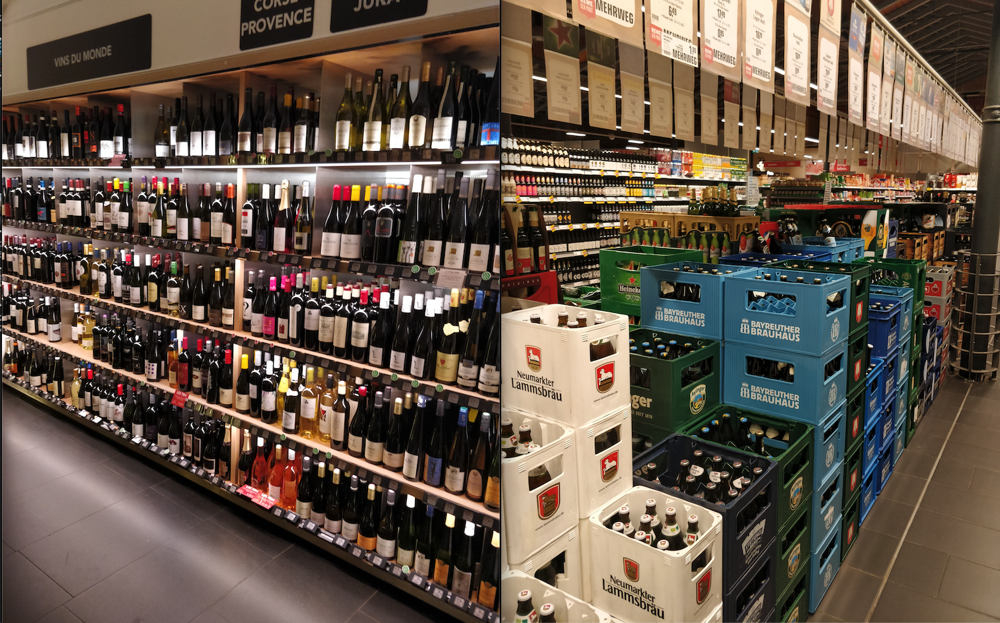

Французы так же строги к приготовлению сыра, и круассанов. 

У Немцев с едой отношения просты: она должна быть вкусна, питательна, и без лишних украшений. Ввиду более сурового климата и спартанского настроя Германцев, немецкая еда состоит из мяса, рыбы, картошки, и капусты. Её вам дают в больших количествах и с единственными приправами: соль и перец. Немецкая еда гораздо ближе по вкусу к Советской и её можно есть каждый день и чувствовать себя здоровым и сытым. К удивлению многих, Берлинская еда очень разнообразна именно потому что Немецкая еда такая скучная. В городе громадный выбор Вьетнамской, Грузинской, Русской, Турецкой, и Итальянской кухни. Волны вышеперечисленных иммигрантов приезжали в Берлин в большом количестве и привозили с собой самое лучшее из своих стран. В отличие от Парижа, где Французская кухня вытесняет все другие, в Берлине прекрасная пицца, хачапура, и медовик. 
## Круг общения ##
С точки зрения Русско- и Англоговорящего иммигранта, и в Берлине, и в Париже можно найти круг друзей, но я заметил принципиальную разницу между стилем жизни этих кругов. И там и там, как бы вы не старались выучить язык, подражать культуре, манерам, и стилям жизни, вас сразу не примут. Через год не примут. Возможно никогда не примут. Тут ни Немцы, ни Французы не виноваты. 


 Как говорил Балабанов "Найти своих и успокоиться". "Свои" в этом смысле не обязательно люди его национальности и социального статуса: их слишком сложно найти. "Свой" круг обычно распространяется на таких же иммигрантов, ведь с ними появилось что-то общее, а именно то что они так же как и он, оказались в "чужом" городе. Уже из этого круга человек начнёт выбирать людей для своего по принципам общих интересов. 
 

Да, есть люди которые исключения из правил. Они настойчиво учат язык, именно избегают общения с иммигрантами и успешно вливаются в новую культуру. Этот путь в одно время я успешно прошёл и сам. Вкратце, это был многостепенный, длинный путь. Нужно не просто знать язык, а говорить на нём в совершенстве и без акцента. Нужно знать тонкости выражений, которые совершенно разные в зависимости от региона страны, а иногда и квартала города. Нужно знать культурные *faux pas* и заставить себя принять мировоззрение, моральный кодекс, стиль жизни. Нужно даже приобрести такие же впечатления как люди этого народа. 

И в процессе понять насколько твёрдо сидит во мне тот культурный фундамент который был заложен до 7‑ми лет и его не искоренишь и за следующие 20. Только через 10 лет жизни в другой стране, вопрос "Откуда ты?" перестал подразумевать "Из какой страны?" и стал "Из какого города или региона?". Только через 15 лет, я стал думать как житель этой страны и почувствовал себя "своим". И стоило мне пожить всего 2 года за границей, и всё это "подстраивание" свелось на нет. И я жил в одной из самых "иммигрантских и либеральных" стран мира. А и Франция и Германия: скорее одни из самых консервативных. Итак, если вам больше 15ти лет и вы оказались в Париже или Берлине, вы никогда не станете Немцем или Французом. С учётом этого, будем разбирать наиболее вероятные сценарии:

В Париже большинство иммигрантов живут коротко срочным проездом, на пару лет. "Увидеть Париж и умереть", как сказал Илья Эренбург, и как часто считают молодые студентки из западных вузов, сотрудники фирм которых в качестве вознаграждения отправили "за границу", рабочие разновидных иностранных органов влияния, remote office айтишники, PhD студенты, владельцы trust фондов, и разновидные au pair, репетиторы иностранных языков, музыки, и тенниса, и члены смешанных браков. Все они тесно жмутся к Англо- и Испаноговорящим кругам (в Париже Русскоговорящих почти нет) и проводят большинство своих выходных открывая новые Французские прелести. 

В этом смысле жизнь во Франции приятна: вы никогда не насытитесь и никогда не узнаете всех прекрасных достоинств этой страны. В моём кругу общения были Англичане, Американцы, Итальянцы, Испанцы, Французы, Украинцы и Бразильцы. Мы вместе ездили по знаменитым лыжным курортам, открывали для себя новые рестораны, пробовали вино на месте его изготовления из множественных виноделен, и все как один клялись что учим Французски и вот-вот "заговорим на нём". 

Теснота нашего круга была прямо пропорциональна той силе которая отталкивала нас от себя: силе Французской культуры. Никто из нас не был настолько наивен, чтобы иметь цель в неё вписаться потому что эта культура сама не желала нас принимать. В ресторанах на наш корявый Французский моментально отвечали на ломаном Английском. На работе тоже переходили на Английски как только я входил в офис. В конце концов по нашим именам и фамилиям уже было понятно что мы "чужаки" и пожилое поколение Французов с особой гордостью любило это подчёркивать. Но, в нашем тесном кругу мне было хорошо и комфортно и я понимаю что мне повезло этот круг найти когда я приехал.

В Берлине много Русскоязычных. По моим подсчётам, минимум полмиллиона. Как я пришёл к этой цифре, по национальностям: [30т Болгар, 26т Русских](https://en.wikipedia.org/wiki/Demographics_of_Berlin), а так же Грузин, Армян, Белорусов, Казахов, [и 300т Украинцев](https://www.berlin.de/en/news/7536243-5559700-over-267000-ukraine-refugees-have-arrive.en.html). Но неофициально так же есть много ГДРовцев которые так и не уехали, [Потомки 360т Белых иммигрантов](https://www.berlin-health-excellence.com/ru/v-berline-kak-doma-russkiy-berlin), и часть из [2ух миллионов](https://cyberleninka.ru/article/n/emigratsiya-nemtsev-do-i-posle-raspada-sssr-v-germaniyu-integratsiya-i-eyo-rezultaty/viewer) Казахских и Поволжских Немцев которые иммигрировали после распада СССР.

Есть в Берлине Charlottenberg, или Шарлоттенград, где Русская речь на каждом углу, но даже за его пределами вы услышите её повсюду. Очень легко найти Русскоязычное сообщество насчитывающее более 1000 людей. Так же легко ограничится общением в нём и не чувствовать себя в чём то ущемлённым. Есть Русскоязычные рестораны, магазины, зубные врачи, детские сады и школы. 

В отличие от Парижских иммигрантов, в Берлине большинство приезжает, чтобы остаться. У многих это получается без особого труда.

# Качество Жизни #
Теперь поговорим о чисто материальном сравнении двух столиц
## Еда ##
И в Берлине и в Париже можно найти недорогие качественные продукты. В обеих странах существуют законы ограничивающее цены на продукты базового питания как масло, хлеб, и молоко. Но в Берлине продукты всё-таки дешевле на 25-30%. В среднем на одного человека который ни в чём себе не отказывает нужно €300 в месяц на продукты, а в Париже €400. Конечно есть те которые в обоих городах могут прожить и за €100. Но это при закупке оптом и использованием машины и большого холодильника. Чем дольше вы будете жить и в Берлине, и в Париже, тем меньше будут ваши затраты.

В обоих городах есть культура рынков, но в Берлине она имеет более развлекательный характер, а в Париже: это место где можно купить свежие, Французские продукты прямо от человека который их вырастил (и заодно встретить повара Michelin ресторана который тоже их там закупает для своего меню)

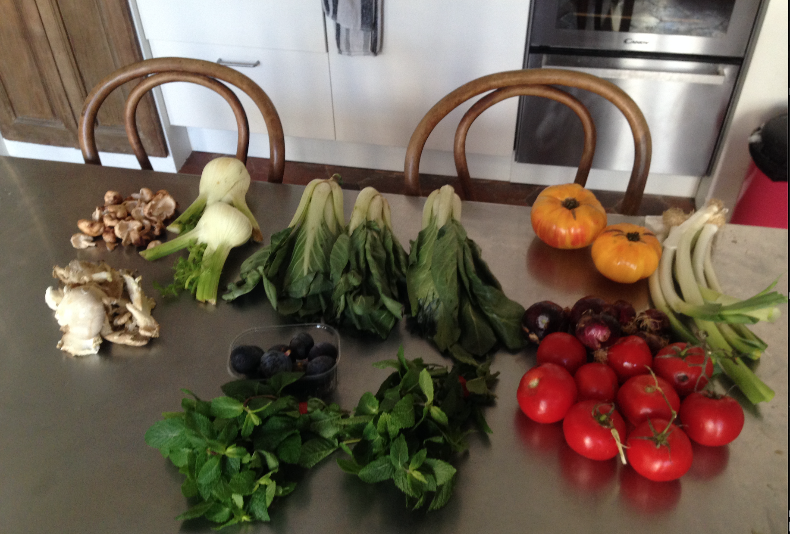

## Жильё ##
В Берлине, как и в Париже большие сложности найти его. И там и там слишком много желающих и слишком мало квартир. В Париже нужно меньше места для того чтобы "жить как все". Обычная холостяцкая квартира в 30м2 в центре обойдётся в €1000-€1,500 в месяц. 

В Берлине за 50м2 в центре и с хорошим ремонтом платят €500-€1000. Качество именно ремонта сильно отличается. В Париже это обычно старые, не отремонтированные дома, где есть вероятность плесени, тонких стен и полов без шумоизоляции. Летом очень жарко, зимой холодно из-за деревянных оконных рам. Полы деревянные, старые, и кривые. 

Но зато, невозможно не любоваться красотой архитектуры в которой вы будете жить. 


Сделаны из кремового известняка, не более 6ти этажей, чугунные балконы, длинные окна. 
- Первый этаж: с высокими потолками для магазинов. 
- Второй: низкие потолки для склада, 
- Третий: Étage Noble, самый изысканный, с большим балконом. 
- Последний этаж, под крышей, для прислуги. Летом крыша накаляется, а зимой тепло исчезает через эту крышу. 


Конечно, как вы наверное догадались, иммигрантам в основном предлагаются этажи для магазинов, склада, и прислуги. Но даже там очень уютно.
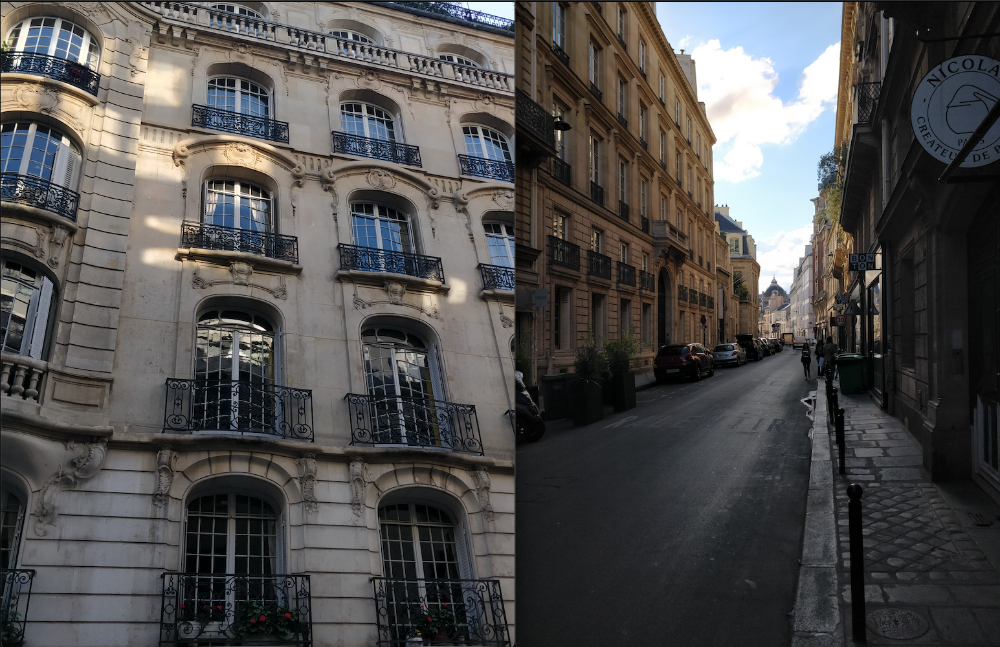
Внутри квартиры, как повезёт, мебель будет старая, но в лучшем случае "античная" и красивая, или простая и с минимализмом:
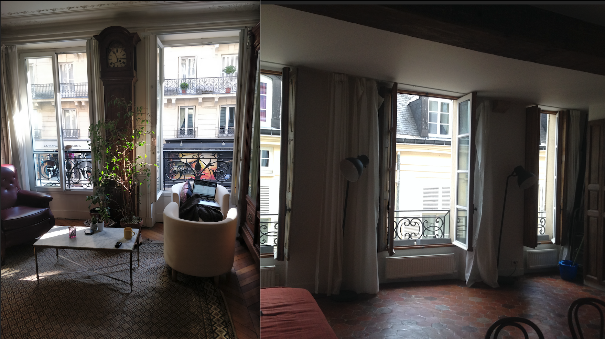
Входя в свой дом, вы должны радоваться. Парижский входной двор или подъезд: особый вид искусства и красоты для вашей радости. Я был настолько поражён этим видом искусства что создал инстаграм только Парижских дверей, [Je adore les doors](https://www.instagram.com/jadore_les_doors/): 

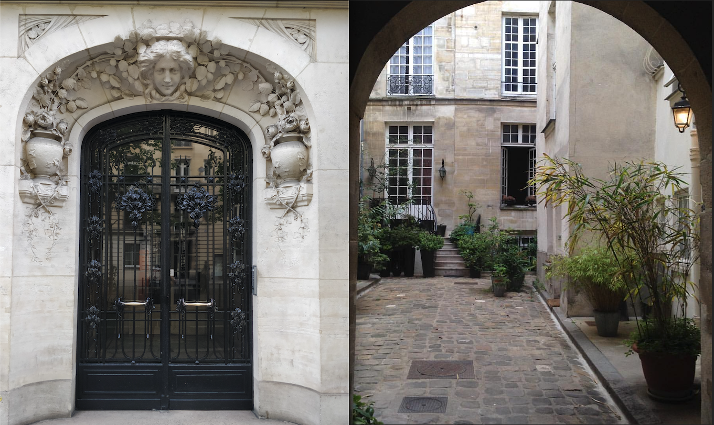

В Берлине нет жёсткого архитектурного стандарта и можно найти то что вам по душе: Altbau, Neubau, Sovietbau итд. Можно жить в Хрушёвке, в Сталинке, в Замке, в высотке, или в двухэтажном доме. Но есть прекрасный стандарт ремонта. Все двери: метр шириной, все окна: прочные и утеплённые, отопление: великолепное и на воде, полы: безупречно ровные и бывают тоже отопляемые. 


Специфика у Немцев, что квартиру вы снимаете "голую", без кухни, мебели, люстр, а иногда даже и пола. Предполагается что вы въезжаете надолго, как в свой собственный дом, и вам не жалко будет его обустроить. Я написал [Довольно длинный пост](/berliving) про то как искать квартиру в Берлине и сколько они стоят.


## Медицина ##
Во Франции в плане медицины все очень просто. Все на одном государственном плане, всем дают одну и ту же карточку *Carte Vitale*, все платят 8% от зарплаты, без доплат. Вам доступны все доктора и больницы, и визит к любому доктору облагается стандартной оплатой: €25. Страховка покрывает абсолютно всех, без исключений (безработица, дети, существующая раньше хроническая болезнь). 

Карточка действует по всему ЕС, и ваша медицинская история хранится в её чипе. Французская система здравоохранения так же хорошо организована: быстро записываешься к врачу и быстро получаешь помощь. То что она организована государством: её громадный плюс, о котором я напишу ниже. По качеству, Французский уровень медицины лучше Немецкого SHI, то есть квазигосударственной страховки которой пользуются большинство Немцев, но хуже, чем PHI (Частной Немецкой страховки). И в Германии, и во Франции: высокий стандарт медицины, но в Германии по ощущениям именно стандарт выше и больше похож на Американский. 

В Германии с этим сложнее. Такое ощущение, что Немцы в какой-то момент решили перейти на Американскую систему полностью частной страховки, игнорируя почти все доводы против такого перехода. Они потом остановились на полпути и получилось "не рыба ни мясо". Страховка в Германии: 7.8% от зарплаты плюс 0.9%. В Германии целых 110 квазигосударственных компаний (SHI) которые покрывают 88% населения и 41 частная компании (PHI), которые покрывают остальных. Из-за множества компаний которые по сути делают одно и то же (а в случае с PHI то ещё и с целью прибыли) к врачам сложно попасть, врачи делятся на "частных" и "государственных", клиники тоже. В обоих типах страховки вам могут отказать как клиенту. С PHI будут сложности если вы потеряете работу, а в SHI вас не пустят если вы много зарабатывали и числились раньше на PHI итд. Чтобы проще увидеть разницу, можете посмотреть таблицу ниже: 
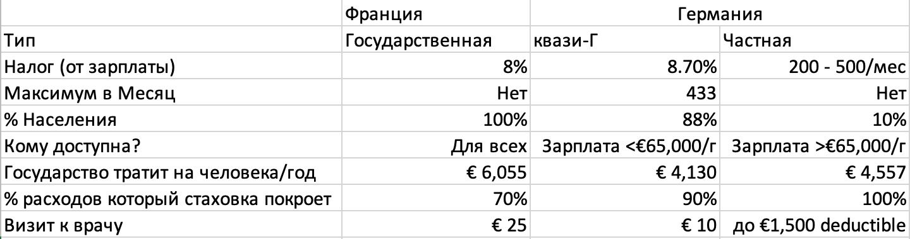
## Транспорт ##
Парижский проездной билет стоит 79 евро в месяц, Берлинский: 50. Парижское метро: однo из самых обширных систем публичного транспорта в мире. По 226ти километрам рельс проложенных на 5ти подземных этажах разъезжают 16 маршрутов между 308ю станциями. Но, транспортируя 4.1 миллиона пассажиров в день, эта система вторая в мире по загруженности после Московской. В час пик там тесно, на многих станциях давка, но привыкнув к тесноте, вы можете доехать до любой точки Парижа быстрее чем на машине. Машину в Париже нет смысла иметь не только из-за недостатка и дороговизны парковки, но и из-за недостатка улиц в городе для машин, число которых ежегодно сокращается коммунистическим и популярным мэром Парижа, Anne Hidalgo. 

Берлинское метро обслуживает в три раза меньше людей, и по размеру в два раза меньше (155км и 175 станций), но в сочетании с 340км рельс S-Bаhn (аналог Парижского RER), оно приятнее, комфортнее, и превосходно спланировано. Несмотря на это, в Берлине всё-таки иногда легче и удобней жить с автомобилем, и я планирую в будущем разобрать [стоит ли в Берлине иметь машину.](/bercar) 


 (или два: один "грузовой" для магазина и развозки детей, а другой "скоростной" для поездки в офис и всех остальных поездок).


Я был поражён разницей в ценах велосипедов: то что в Париже можно приобрести за €100, в Берлине вы купите за минимум €500. Частично причина этому Парижская организация по реставрации старых велосипедов. В конце концов Французские знаменитые Peugeot, Renault и Motobecane, одни из более 50ти известных Французских вело производителей 80ых годов. Эти велосипеды даже 60 лет после производства до сих пор верно служат их хозяевам. Организация по реставрации часто организует "распродажи", где можно купить прекрасный и выгодный велосипед:

С другой стороны, в Берлине безопасность велосипедистов организована на гораздо более высоком уровне. В отличие от Парижа, есть вело-светофоры, всегда есть отдельные вагоны для перевозки велосипедов на метро и поездах, есть отдельно размеченные велодорожки. Но так же есть строгие законы, нарушив которые вы можете получить довольно неприятный штраф. Штрафуют даже за то, что проехался по тротуару свернув в магазин или за то что едешь по велодорожке, но не по той стороне улицы. В Париже вас редко остановят даже за грубое нарушение и часто отпустят без штрафа даже если "попадёшься". 

В плане транспорта, надо так же отметить аэропорты. В Париже их три: Charles de Gaulle, Orly и Bеauvais. В Берлине один Schönfeld. Париж: это международный хаб для самолётов. Можно улететь почти в любую точку мира прямым рейсом, много раз в день и дёшево.

Аэропорт Берлина: маленький и региональный. Есть прямые рейсы в часто посещаемые города как Palma de Mallorca, Рим, Барселона, Лондон. Но если вы запланировали более дальний перелёт, вам придётся пересесть во Франкфурте, Париже, Амстердаме, или Лондоне. Самолёты летают реже и полёты сравнительно дороже. 

В плане удобства планировки отпусков, Париж гораздо удобней, поэтому если вы хотите увидеть Европу и не разориться, выбор очевиден. 

## Работа ##
И Немцы, и Французы много работать не любят, но выражают это по-разному. Французы постоянно жалуются на то сколько им нужно работать, хотя по закону работают не более 33ти часов в неделю. Немцы скорее работают напоказ и в среднем по 40 часов в неделю, что не сравнимо с Американскими 50-60. 

Хотя Французы много жалуются на работу, часто опаздывают, берут по часу - два на обед, я нигде не видел настолько сосредоточенных и эфективных сотрудников. Они качественно и быстро справляются со своей работой, успевая и поболтать, и попить чай и кофе с коллегами. Их жалобы часто не надо принимать в серьёз потому что жаловаться: часть Французской культуры. 

Немцы вовремя приходят, берут короткий обед, и вовремя уходят. Они чаще не успевают сделать задачи вовремя, но зато делают всё дотошно, качественно, и ничего не оставляют на "авось". Они так же никогда не скажут тебе что недовольны работой или работодателем (даже если это на самом деле так).

В обеих странах: выходные - святое время от работы, контракты хорошо защищают сотрудников от увольнения, и Немецкие 5 недель отпуска сравнимы с Французскими 6-7 недель в году. В плане зарплат, в Берлине на €10-€20 тыс. в год больше и работу тоже легче найти, и в Германии работать по ощущениям спокойнее из-за более чётко поставленных задач и более стабильной культуры начальства. Французские менеджеры часто сочетают в себе "творческие порывы", останавливая один проект на полпути и необъяснимо выбирая другой. 

И там и там, можно найти работу на Английском если у вас есть высшее образование и специализация, но для Французов знание языка всё таки важно, а для Немцев гораздо менее принципиально. 

И во Франции и в Германии, отношения с коллегами по работе очень дружественное, но Немцы более сдержанны и поэтому редко можно на самом деле подружиться с коллегой если он или она тоже не оказалась иммигрантом. Немцы более склонны всей командой пойти пить пиво после работы, а Французы больше любят приносить вкусные деликатесы в офис и делиться со всеми за чаем в рабочее время, оставляя нерабочее время для друзей и семьи.

## Налоги ##

Для сравнения, я попытался сделать таблицу по которой приблизительно можно понять, где налоги больше: 
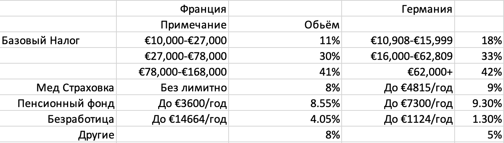

По ощущению, в Берлине и цена проживания дешевле, и налоги ниже. Но я бы не назвал эти отличия значительными

Итак, мой дорогой читатель, надеюсь теперь вы сможете сами для себя ответить на вопрос где бы вы хотели жить.

 Там у них уклад особый,
	  Нам - так сразу не понять.
	  Ты уж их, браток, попробуй
	  Хоть немного уважать.

	Будут с водкою дебаты - отвечай:
	"Нет, ребяты-демократы,- только чай!"
	От подарков их сурово отвернись,-
	"У самих добра такого - завались."

	Он сказал: "Живя в комфорте -
	Экономь, но не дури.
	И, гляди, не выкинь фортель -
	С сухомятки не помри!

	В этом чешском Будапеште
	Уж такие времена -
	Может, скажут "пейте-ешьте",
	Ну, а может, - "ни хрена".
    -В.С. Высоцкий