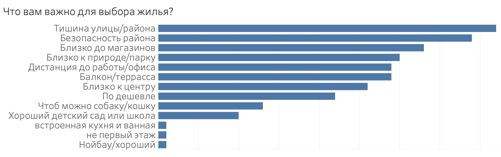
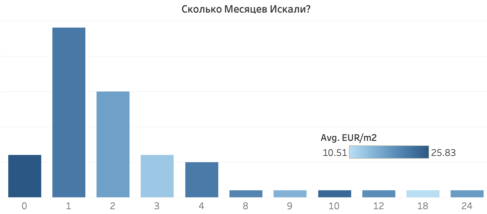
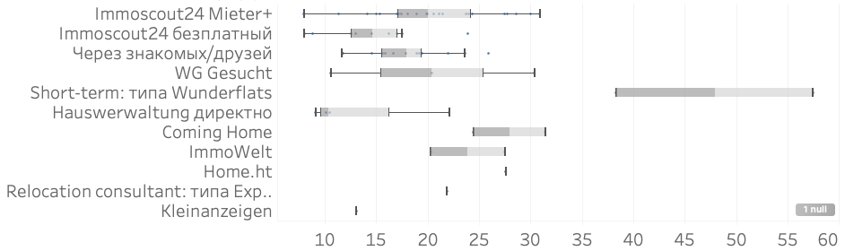

 
Найти квартиру в Берлине сложно. Почти невозможно с первого раза найти то что нужно, особенно если переезжаете из за границы. В 2022ом году, [137 тыс](https://www.iamexpat.de/expat-info/german-expat-news/online-meldebescheinigung-service-launch-across-germany) людей вьехали в новую квартиру в Берлине и эти цифры тольно растут. 
# Проект
Поэтому был создан проект, где Русско- и Англо-язычные новоприежзие в Берлине поделились своим опытом и помогли со сбором данных на этот ресурс. Если вы тоже хотите поделиться, это можно сделать анонимно и за 5 минут заполнив [Опросник](https://forms.gle/5p35oNprmwdeqgwj8). 
# Что искать?
Более 50% из опрошенных людей хотят поменять жильё и это намёк на то что выбор первичного жилья был изначально неверным. Чтобы не попасть в эту ситуацию, надо ознакомиться с факторами которые оказываются важными для людей на личном опыте. 
## Важные факторы

1. Большинство людей сказало что хочет тишины. Для этого надо избегать квартир рядом с большими улицами и больницами. Так же искать подальше от центров и точно подальше от больших дорог. Из личного опыта, если на вашем перекрёстке проезжает трамвай и особенно если поворачивает, вы никогда не привыкнете к этому шуму. Можно так же ознакомиться с [картой шума в Берлине](https://www.berlin.de/umweltatlas/en/traffic-noise/noise-pollution/2022/maps/artikel.1327941.en.php)
2. Безопасность района. Я перевёл на Русский и на [карту криминальную статистику Берлина](https://public.tableau.com/views/CrimeStatsinBerlin2022v2/Dashboard1?:language=en-US&publish=yes&:display_count=n&:origin=viz_share_link) за 2022 год
3. Близость до магазинов, просто. Чем ближе к центру, тем их больше, и наоборот.
4. Ближе к природе- дальше от центра. Всё то же логично. Как правило, вокруг Берлина везде природа, но на Южной части не так красиво.
5. Дистанция до работы: Есть прекрасный сайт который показывает [время на обшественном транспорте до любой точки Берлина](https://www.mapnificent.net/berlin/#13/52.5351/13.3185/720/52.5187/13.3875). Не очевидно и очень удобно: 

## Описание Районов
Искать по районам, как Pankow, Mitte, PrenzlauerBerg имеет смысл, но дать описание району бессмысленно, как вы можете убедиться посмотрев на карту ниже. Даже в "любимом" кайоне как PzB можно найти довольно непригодный для жилья уголок, и наоборот даже в Moabit бывает очень даже хорошо. Вместо 12ти районов, удобнее ориентироваться по 200 почтовым кодам. 

Наводя мышкой на каждый участок можно прочитать что думают жильцы об их районе. Как видите, карта не полная. Так же справа можно выбрать параметры и посмотреть из каких районов люди хотят уехать. Вы можете помочь [заполнить](https://forms.gle/PJe2MDd97Wrw8E1S6) анонимно про свой район и квартиру и помогите всем кто ишет себе идеальное место в нашем городе.



# Где искать? 
Теперь когда у вас есть представление о том что вы ищете и где, метод поиска можно оптимизировать по цене и времени которое он у вас займёт.
## Время
Конечно правда что чем дольше ищешь, тем дешевле получится но как видно ниже, 2-3 месяца это оптимальный срок поиска за которое можно найти по-дешевле. Те кто хвастаются что ищют целый год, явно что то делают не так: 

## Платформы
Самая популярная платформа: [Immo24](https://www.immobilienscout24.de/), и как не странно, самый популярный метод поиска: её платная версия [Mieter+](https://www.immobilienscout24.de/meinkonto/premium-mitgliedschaft/). Мне они не платили это написать, и мне даже не очень приятно что они за такое берут деньги, но в связи с большим недостатком жилья и огромным спросом, они почти захватили весь маркет в Берлине. Люди им платят в основном потому что они предоставляют справку о кредите: SCHUFA (которая сама по себе может стоить €30), и потому что у вас на 3 дня раньше есть доступ к обьявлениям чем у безплатных пользователей. В поиске жилья, обьявление о нормальной квартире по нормальной цене "закроется" за пол часа, набрав 300+ заявок.
 и в сколько месяцев в среднем каждый занимает")

Платформы деляться на 3 типа: 
### Быстро, не выгодно, и дорого 
Тут в основном расчитывают на тех кому надо найти срочно жильё за любую цену и у кого ешё нет ни кредитной истории, ни прописки. Они предлагают гарантированноё жильё в почти коммуналках за бешенную цену. Но зато, они дешевле отелей. Их удобно брать если компания в которой вы получили работу готова платить за ваш переезд и проживание. Самые популярные: 
- [Crocodilian](https://crocodilian.de/moebliert-wohnen-auf-zeit-berlin/)
- [Coming Home](https://www.coming-home.com/en/)
- [Wunderflats](https://wunderflats.com/de)
Их легко найти, негко подписать короткосрочный контракт, и у них есть репутация которую они хотят сохранить, поэтому не кинут. Я бы посоветовал лучше найти через AirBnB и брать по месяцам у частника
### Маркет агрегаторы 
- [Immo24](https://www.immobilienscout24.de/) - Самый большой и популярный
- [ImmoWelt](https://www.immowelt.de/) - Больше расчитан на Немецкую публику
- [eBay Kleinanzeigen](https://www.kleinanzeigen.de/stadt/berlin/) - так же полезен для покупки подержанных авто и мебели
- [WG Gesucht](https://www.wg-gesucht.de/) - тут часто не только комнаты но можно найти и целую квартиру
### Частные методы
- Через друзей, знакомых, и родственников конечно всегда можно избежать все неудобства. Можно так же поискать в телеграмме чат ЕЛБ в котором всё больше активности
- Через Haurwervaltung, или фирма которая заведует квартирами. Тут могут помочь друзья, которуе обратяться в свою фирму за ваш счёт. Рекомендация людей которые уже "проверены" на самом деле многое значит. 
-  Если фирма платит, то скорее всего они вам найдут и квартиру, правда за те же деньги почти всегда можно найти лучше и без них. Конечно оставаться в квартире которую нашла фирма после срока когда она оплачивает аренду не советую.

Мы уже сравнили эти методы по времени поиска, а сейчас самое важное: сравнить по тому какую цену за кв.м каждый метод приносит чтобы сильно не переплатить: 

Если у вас возникли возражения по поводу того что не стоит сравнивать агрегаты квартир с короткосрочным контрактом, а так же сравнивать ограниченные (мебелированные) контракты и неограниченные, вы можете сами настроить параметры и получить от данных что вам нужно по ссылке в [Tableau](https://public.tableau.com/app/profile/todor.khristov/viz/2023mobile/Mobile?publish=yes&:device=phone)

### Рост цен
Всегда есть мнение что цены растут и часто слышим истории про Немцев которые подписали безссрочный контракт в 1990ом 100м2 за €200/месяц. На самом деле таких мало осталось и далеко не все кто раньше приехал получили такие сказочные контракты. Данные скорее показывают что растут не столько цены сколько *разброс* цен. То есть можно ешё найти приличную цену с удачей и терпением: 
 назад")

Итак, в последний раз, если вы хотите поделиться своим опытом анонимно и помочь этоу проэкту, заполните пожалуйста [этот короткий опросник](https://forms.gle/PJe2MDd97Wrw8E1S6).
# Как найти?
Теперь соберём советы тех кто успешно нашёл. надо быть готовым, надо правильно искать, и не попасть на типичные скамы которых к сожалению не мало.
## Документы
Сначала представим полный список: 
- Личное письмо с фотографиями
- Arbeitsvertrag: Подписанный контракт с работодателем
- Паспорт и Виза
- Entgeltabrechnung: 3 квитанции о выданной зарплате
- Mietschuldenfreiheirsbesicheinigung: Письмо рекомендация от бывшего арендодателя о том что у вас нет к ним долгов
- SCHUFA: Кредит репорт что нет долгов

Конечно если чего-то в списке у вас нет, то надо попытаться найти замену. Если нету контракта или зарплаты, покажите банковский счёт. Если нету письма он бывшего арендатора, пусть ваш бывший арендатор из зашей страны приезда подпишет (на Немецком), Schufa дают всем, даже если нет кредитной истории, будет стоять что "истории нет" что гораздо лучше чем "история плохая. 

В принципе если вас попросят какие то другие документы кроме этих, это должно служить красным флагом что что-то не так. В лучшем случае какой то придирчивый товарищ вам попался. А в худшем, вас путаются обмануть.
## Стратегия
Мы уже видели что надо быть готовым искать хотя бы месяц. Это сложно сделать если вы уже не в Берлине, поэтому настоятельно рекомендую планировать арендовать на месяц в AirBNB или короткосрочную квартиру и уже искать отсюда. Заранее найти и подписать качественный договор: это почти неслыханно. 

Если ищете как большинство, через Immo24, то надо:
1. Каждый день или пару раз в день искать и посылать стандартное письмо на Немецком: 
- Нам очень нравится
- У нас такая зарплата
- готовы брать сразу
- когда можно увидеть? 
- Хотим там жить долго
Написать придёться от 70-100 раз, из которых вам ответят раз 10, а посмотрите вы всего 2-3 квартиры
2. Как только вас приглашают, берите все распечатанные документы и идите на просмотр. Бывает что вы придёте и там стоит очередь из таких же как вы. Это вполне нормально, просто значит что ваши шансы снижаются, но кому-то повезёт. Так же, скорее тот кто показывает не явлаяется собственником квартиры а просто "агентом" или посредником. Его/её особо очаровывать не стоит, она просто собирает документы а собственник будет решать. Часто вы собственника даже никогда в лицо не увидите а будете обшаться с посредником из фирмы haurwervaltung. Ничего страшного.
3. Не теряйте надежды и верьте в метод. Если прямо ничего не работает и никто не зовёт, то или вам надо искать за цену повыше, или снизить ожидания. 

## Схемы скамов
Необходимо заранее знать про возможные признаки мошенничества: 
1. Деньги вперёд: Пока не увидели квартиру, не поздоровались с хозяином или с фирмой которая сдаёт квартиру, пока не получили подписанный контракт и сами не подписали, и часто пока не получили ключи, *не высылайте никому деньги*. Ни за "депозит", ни за "гарантию", ни за "услуги". Если вас о таком просят, вежливо обьясните что без контракта и без ключей вы деньги не шыслите. Конечно некоторые "честные" хозяева могут об этом попросить но они сами знают что не в праве и не по закону это делают. К сожалению у хороших квартир тоже бывают нагловатые хозяева, но их можно поставить на место.
2. Слишком хорошо чтобы было правдой: Часто такие обьявления используют слишком хорошие фотографии или слишком дёшево предлагают. Reverse image search обычно легко находит их "фотки" на сайте квартиры в где нибудь в Тайланде. 
3. Более изошрённые истории: 

Человек встретил арендодателя, в квартире, получил ключи, подписал контракт. На месте его попросили отдать часть депозита наличными. На следуюший день он пришёл и увидел что замки поменяны и "арендаторы" пропали безследно. Не надо никогда платить наличными. Только через банковский счёт. Всегда не плохо проверить имя и фамилию человека с которым вы подписываете контракт. У них как минимум должен быть Facebook и Linkedin. В этом смысле иметь дело с Hauswervaltung гораздо спокойнее и совсем не дороже "частника".

Другой случай: Посмотрели квартиру, проверили собственника, подписали контракт, получили ключи. Но собственник сказал что сделал ошибку в контракте и не правильно указал свой банковский счёт. Тоже скам. 

И так, надеюсь вам помогла эта информация и удачи!

