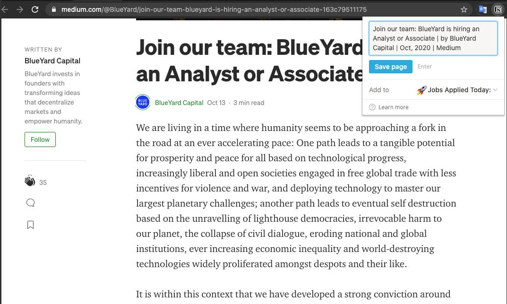
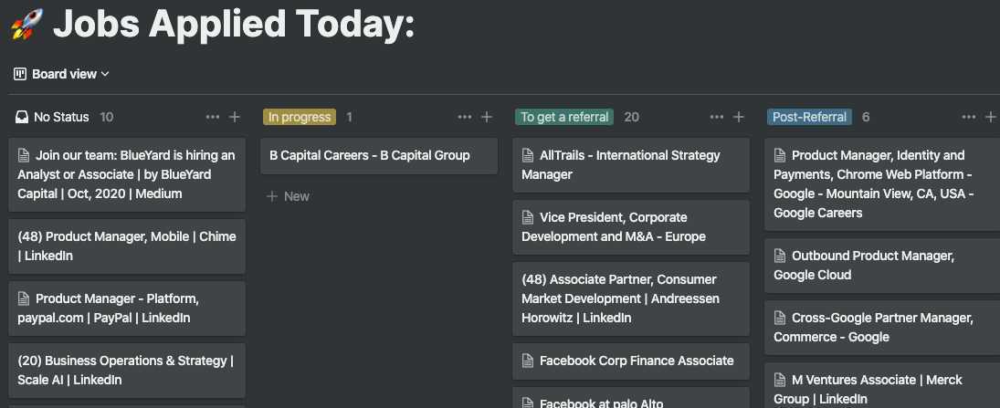
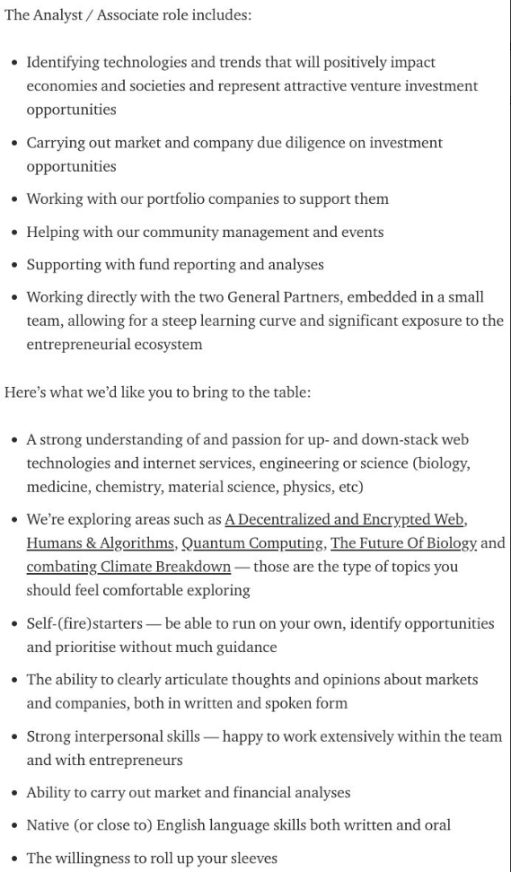
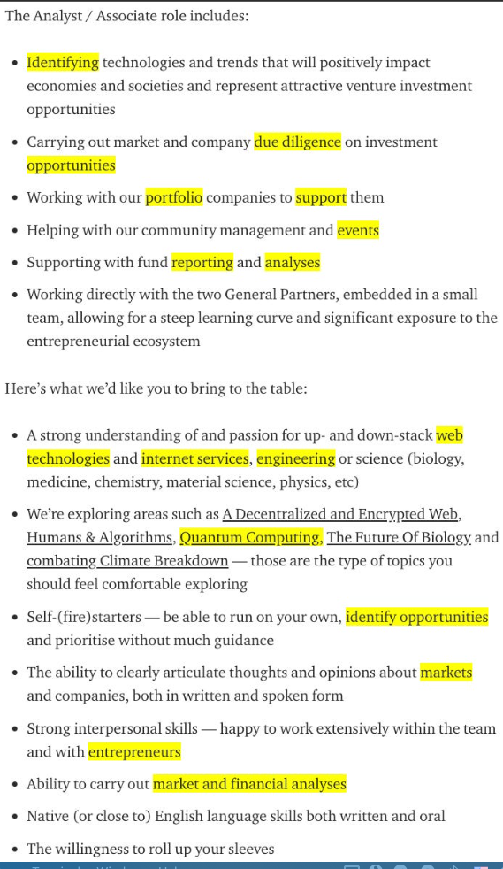
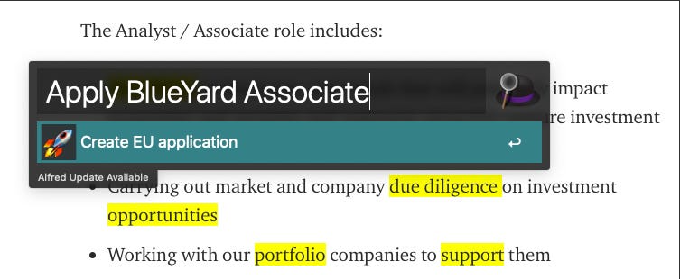
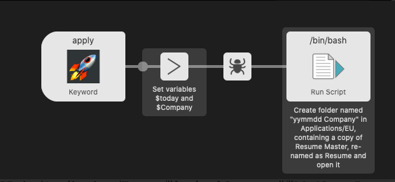
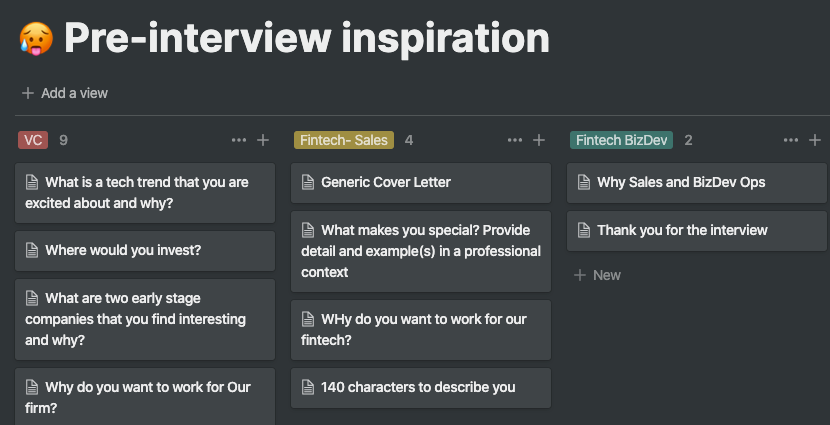

# Who is this guide for?
For those who are targeting a fragmented market, where job hunting is similar to Sales, where you have to set up the funnel and churn through until you get a positive result. Some examples of fragmented job markets are: any VC role, BizDev, CorpDev, Sales, Marketing, Product Management, Account Management, Internal Strategy, Ops. Here, the biggest predictor of success is Volume of applications. To increase Volume, you need to make applying to jobs as pain-free as possible.



We will be relying on a simple concept:



To apply to a job, you have to overcome your fear of rejection, not get distracted, find faith and resist Netflix, which takes effort. This effort to get started (activation energy) is the same for each application regardless if it’s your first or 100th one. Once you get started, the momentum is usually sufficient for you to power through (pictured here by the boulder rolling down the hill). I propose, you lower the hill using tools, like a shovel. Here is one way to build the shovel:

1. Eliminate distractions
2. Automate application tracking
3. Automate Resume tailoring
4. Automatic folder system
5. Auto-completion of correspondence
6. Automatic job sourcing

## Eliminate Distractions
After analysing my job search habits, I found that I doubled my application rate by blocking both Linkedin and Facebook newsfeeds. I need both networks to reach out to my network but I don’t want to get distracted while on task. Install these add-ons and thank me: [Feed Blocker for Linkedin](https://chrome.google.com/webstore/detail/feed-blocker-for-linkedin/eikaafmldiioljlilngpogcepiedpenf) and [Kill News Feed for Facebook](https://chrome.google.com/webstore/detail/kill-news-feed/hjobfcedfgohjkaieocljfcppjbkglfd?hl=en). If you are feeling extra, delete your Instagram and TikTok. Until that dream job is yours.

## Application Tracking
You need a Kanban board to keep track of where you applied with as few clicks as possible. Install [Notion](https://www.notion.so/desktop) and the Chrome [Notion Add-on](https://chrome.google.com/webstore/detail/notion-web-clipper/knheggckgoiihginacbkhaalnibhilkk?hl=en). Finally, install the [Highlighter](https://chrome.google.com/webstore/detail/highlighter/fdfcjfoifbjplmificlkdfneafllkgmn) in Chrome, which will help you not read a posting twice. Now, find a job. I will take a random job posting as an example of how our shovel works:
 
One click with Notion Add-on and it goes to your Notion Board. Naming and adding the date happens automatically. In Notion, re-name your main board and set up your funnel. I recommend the Funnel to be set-up as follows: No Status>In Progress>To Get Referral>Post-Referral>Interviewing:
 
This way, you can save jobs you find while you are applying for your first one and not get distracted by starting several applications at once. Notion not only creates the ticket automatically but records the date created, the link to the job posting and the job posting content in case it gets deleted. You might get invited to the interview but forget what you applied for so this feature is useful. The blinders keep you on track and the process of moving things around the Kanban releases endorphins (hopefully).

## Resume Tailoring

Dreading to customise your resume for each job posting is a major reason for lack of application volume. Here is how to simplify the process. Set the shortcut for the Highlighter Add-on to a key combo (I used ‘Command+D’) and as you read the description, highlight relevant words (About 5%-10% of the total verbiage). The example job description turns from this:
 
To this:
 
What to highlight comes with practice. One day, an AI could do it. Not today. The goal of this process is to lower the activation energy of the recruiter in 3 ways:

- Terminology: If use the term “entrepreneurs” to indicate start-up founders , or the phrase “identified opportunities” to describe deal sourcing, its pedantic, but change it to match how they call it.
- Order: The order in the example is Sourcing, due diligence, portfolio support, events, analysis. I would arrange my resume items in the same fashion
- Keywords: If you know about Quantum computing, and are an Engineer, mention it!

## Automatic Folder System

Since each resume is custom, I want to remember what I sent, when I sent it, and have a folder to add interview materials, cases, research. I also want to start each application with a 1.5 page Master Resume and cut it down to the job description as in point 3. Here is what the final tool looks like:

To trigger the application process, I bring up [Alfred](https://www.alfredapp.com/) with a keyboard shortcut “Alt+Space” and type in:

Apply <Company + Job>

 
This action automatically:
- Creates a folder named “yymmdd BlueYard Associate” in my “EU Applications” folder
- Takes a copy of my custom EU Master Resume, puts it in this folder, re-names it to “My Name + BlueYard Associate”
- Opens it on my desktop side by side so I have no escape but to finish what I started. When I am done, I save as .pdf. Horse Blinders.

This creates a neat order system so I know where I applied, when, with what version



From this, you can tell that my lack of focus extends to my career interests. But there is a pattern, it’s just hard to see.

## Record-keeping, under the hood:

Alfred is a powerful tool. It’s worth buying just for the TextExpander features. But it also lets you run bin/bash scripts. It takes the company name as variable, takes today and puts it in a 2-line script like so:
 
With the script being:

mkdir -p ~/GDrive/Applications/Europe/"$today $Company"

cp -R ~/GDrive/Applications/Europe/"My Name EU Master.docx" ~/GDrive/Applications/Europe/"$today $Company"/"My Name Resume $Company.docx"

open ~/GDrive/Applications/Europe/"$today $Company"/"My Name Resume $Company.docx"

I have several keywords depending on where I am applying/what role/etc. And with enough requests, I can post the compiled workflow so you don’t have to set it up yourself.

## Auto-Completion of correspondence

Once you finished your resume, they might hit you with the “Why do you want to work for us?” or “What makes you special?”. I bet you answered this in the past and venturing deep into your soul each time is emotionally exhausting. Here, Notion is your friend again. Create a different Kanban board where you save each question/Answer so you can quickly locate it again:
 
For those unaware, TextExpander is a powerful tool where in the cover letter box, you type in “qwe” or “asd”, and what gets pasted is:

Dear {cursor position},

I am writing to express my interest in applying to the {clipboard content}, YYY office. Given my X background, experience in Y, and a Z, I believe that I would be a good fit for the role. I could immediately contribute to the team as early as June 2020. Some of my relevant work experience includes:

X evidence

Y evidence

Z evidence

I have attached a copy of my resume for your reference, and I hope to hear from you soon. Thank you for your time and consideration.

Best,

My Name

With this feature, your keyboard becomes that much more time-saving. You can use Alfred’s “Snippets” option, buy the original [TextExpander](https://textexpander.com/) or it’s many clones. It is useful for Linkedin intros, e-mail campaigns, etc.
## Inbound flow

By now, the pesky hill should be negligible



Now you need to find more rocks to roll down that hill. For this, you should set up a system. Linkedin Premium algorithm is surprisingly good at finding jobs after you teach it what you like. Niche bloggers like [John Gannon](https://johngannonblog.com/) and others feed you daily positions in small increments. Sometimes you read someone’s blog on VC/fintech/, think they are cool, see where they work, and apply.

So long!