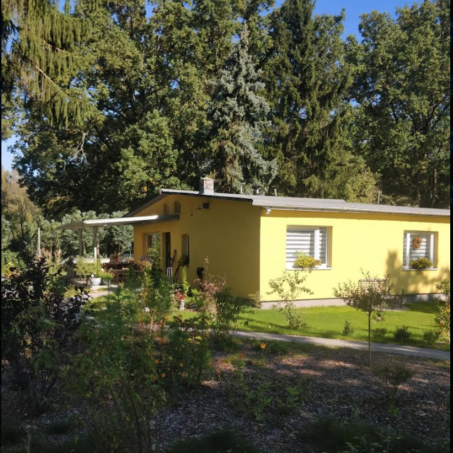
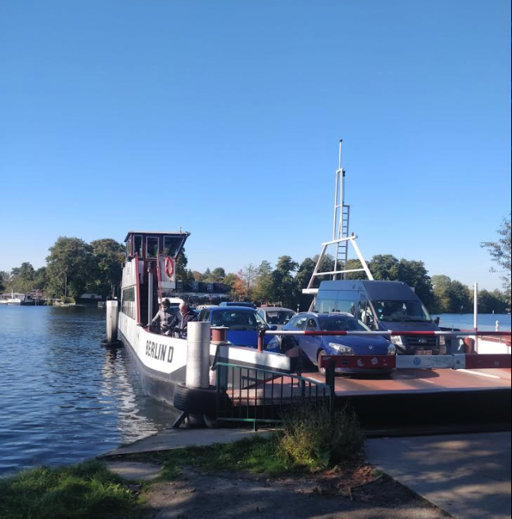
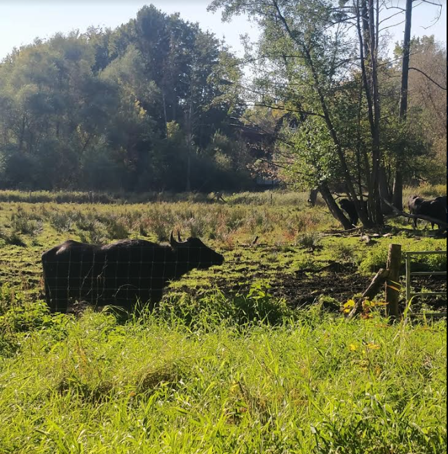
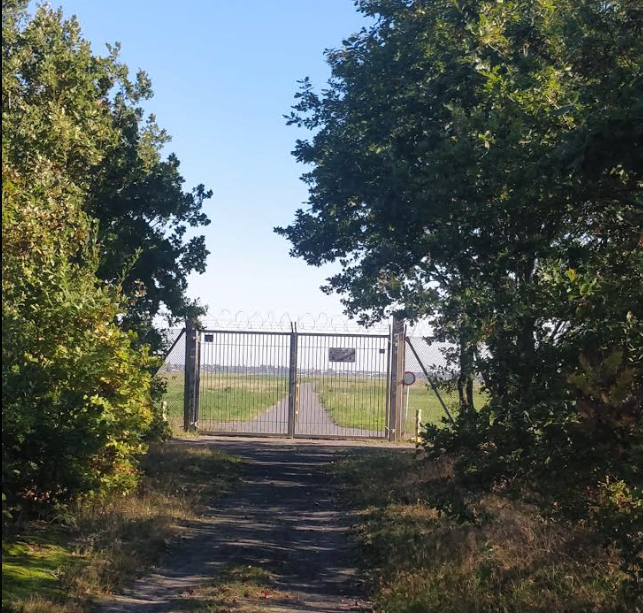

Пробежался по Берлину, начал путь с утра. 20 минут на поезде и я уже в лесу. Какой же быстрый поезд и как быстро я попадаю из мира дорогих квартир и шума рельс в тихий район, с красивыми, высокими домиками. У каждого Немца свой участок. Британцы говорят: "Мой дом, моя крепость" а у Немцев заборы низкие, как будто они хотят сказать "Посмотри на мой дом, как я аккуратно обрезал куст квадратом. Как на газоне не лысого пятна, не одуванчика. Посмотри внутрь дома через окно у которого нет штор. Нам нечего скрывать. Всё внутри так же аккуратно как снаружи. Похвали меня". И все дома такие, чистая краска, новые крыши. А как же всё таки они хорошо тут живут. Уж не впрямь они нас лучше и старательней?

Когда я был школьником я часто замечал в моих товарищах какой то чудной настрой к жизни. 
- "А мне всё равно что обо мне думают" 
- "А мне не важно, зачем тебе этот смысл жизни? Жизнь бессмысленна, ты всю жизнь будешь искать и ничего не найдёшь. И время потеряешь. И пожалеешь"
- "Да не переживай ты, все заменимы"

Как так? Всё равно что люди думают? Ведь у них так много самоважности, самовлюбленности, им же будет так больно и обидно если они узнают что с ними не считаются, что их не слушают. А мне не всё равно, я не хочу им делать больно. И с другой стороны конечно я сам такой. Я тоже не хочу падать в их глазах. Мне это важно. И смысл жизни тоже важно. Чтоб не ошибиться. Не потратить жизнь на "Пустое" как все напутствующие книги предупреждают. Не хочу попасть в ловушку денег, азарта, самовлюбленности. Как маленькой принц с планеты на планету скачу от всех ловушек. Не хочу жалеть тоже. И хочу быть честным и смелым, принципиальным как герои фильмов. И я не думаю что люди так легко заменимы.

Так вот, может в этом секрет Немцев. Они мало думают и только строят, стригут. Один кирпич как другой. У них есть любимое слово: Ordnung. Ни на Русский ни на Английский не переводится. Значит образ жизни где всё за тебя продуманно и с этим надо навсегда смирится. Немец растёт и получил тройку на экзамене. Значит он: в автомеханики годится а в университет: нет. 
- "Но он же просто побаловался, он может на 5! Просто не внимателен, не понял важность экзамена" 
- "Нет. В университет идут те кто понимают, те кто не балуются" 

В СССР бы каждого двоечника тащили до конца, родители, учителя, приятели. Помогали бы. В Германии (и в Америке тоже) такого нет. Кому то надо быть механиком. И смирение с тем что кто то за тебя всё продумал, только следуй этому, вот в чём дело. И так же с другими важными вопросами по жизни: Что изучать, когда жениться, как жить, всё написано и продуманно Пастором в церкви. Немцы с религией не шутят. Много их ответов там. Но поэтому из них ни композиторов ни писателей не получается много . Ведь творческому человеку надо смотреть за рамки. За Ordnung. 

Я бежал по тропе через лес. На 15ом километре надо было пересечь озеро на пароме. Туда к нам заехал микроавтобус и из него вышел папа с девочкой. Девочке года 4 и она с восторгом чуть не перевесилась через борт. Папа седой. Вообще в Европе почти все папы седые. Одеваются точь в точь как их дети: джинсы, белые кроссовки, футболка. Усталый вид на лице. Не зря сегодня средний возраст в Европе 41 год. Рожают люди поздно. После того как "насладятся" жизнью. Мамы нет. Я сразу подумал "развелись". Зачем я его в этом заподозрил? 

У меня был коллега по стройке, Кудаш из Киргизии. Мы с ним часто обсуждали жизнь потому что он Восточный человек. Он первого сына получил лет в 40. И с одной стороны говорит что устаёт с ним. Сил нету с ним гулять и как то меньше энергии на всё. Он советовал мне не иметь детей поздно. С другой стороны, он в свои 40 лет очень мудр по отношению к сыну. Разговаривает с ним как на равных. Никогда не бьёт, всегда спокоен, всегда с ним как со взрослым. Даже когда сын подрался на хоккее с какими то хулиганами, он не рассердился. Сказал: у них так, а у нас так: если обидели, надо защитить честь. Спокойствие приходит с возрастом. 

Так же спокоен с женой. Она отлично готовит, накрывает, убирает. Он на стройке целый день. Редко ему везёт. Он, как большинство иммигрантов, не хотел оставаться в Америке. Хотел приехать, поднакопить, подзаработать, и назад в светлую Киргизию где люди ближе. Но, год за годом здесь и с года в год ничего не копиться, одни затраты. Вот уже 25 лет прошло. Но жена не возмущается что он её увёз в страну где она совсем чужая и где за стенами квартиры ей делать нечего. Ни огорода, ни подружек. И живут они бедно на зарплату строителя. Но она всегда улыбается. Вот такие Восточные женщины. 

Интересно будет посмотреть на поколение которое выросло с седыми родителями. Будут ли они лучше и морально возвышенны? Газеты говорят нет, но меня вдохновляет то, что нам и им никогда не надо было воевать. Сложно бежать мимо этого заброшенного аеропорта, этих пустырей, и не думать о том как здесь почти подростки, умирали. Было много мести, много самолюбия. Седые молодых бросали вперёд как пешек. Такого в нашем поколении нет. И в поколении наших родителей тоже нет. Надеюсь никогда такого больше не будет. 