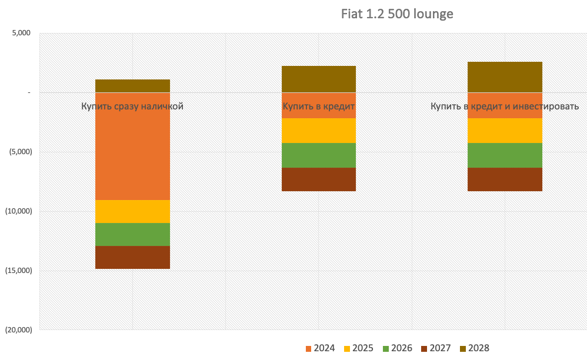
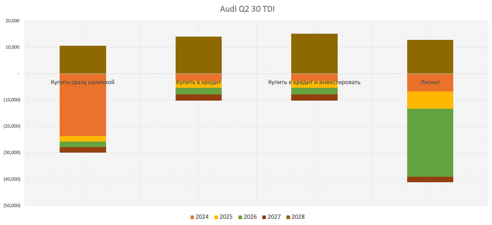

# Стоит ли в Берлине иметь машину?

Короткий ответ: если вы живёте в Берлине, планируете тут остаться на 5 лет, и в среднем проезжаете около 6,000км+ в год на carsharing и арендной машине, вы дико переплачиваете. Пора задуматься о покупке или подкачать ноги для велосипеда.

# Годовая стоимость машины #
Для простоты, я введу один термин: Годовая стоимость машины (ГСМ), и он будет включать абсолютно всё: горючее, страховку, налоги, починку, техосмотр, и потерю машины в цене. Тут мы заранее ставим параметры: Вы будете жить в Берлине 5 лет и в этом году хотите купить машину, чтобы через 5 лет её продать в Германии, используя её как средний Немец, проезжая [11,600км в год](https://www.odyssee-mure.eu/publications/efficiency-by-sector/transport/distance-travelled-by-car.html). С такими ограничениями, мы не будем рассматривать более экзотичные варианты покупки машины (собрать битую, пригнать из Дубая итд.), на которые у большинства из нас нет ни времени ни желания. Ответ на вопрос: сколько стоит в год иметь машину учтёт почти все возможные варианты доступные в Германии и вы с точностью до +/-10% сможете предсказать ваш ГСМ для любой модели любого года.  Итак, поехали!

## Потеря в Цене ##
Самая значительная затрата на машину: то что она теряет в цене из года в год. Если вы купили её за €15,000, а продали через 5 лет за €10,000, потеря: €1000/год или €83/месяц, не учитывая инфляцию.(а позже мы и её учтём). Об этом много говорят, но редко найдёшь данные о точном количестве. Да есть платные сайты как [ADAC](https://www.adac.de/rund-ums-fahrzeug/unfall-schaden-panne/adac-pannenstatistik/), [KBA](https://www.kba.de/EN/Themen_en/Marktueberwachung_en/marktueberwachung_node_en.html), [Schwacke](https://schwacke.de/), но для любого это и запутанно, и дорого, а главное все они измеряют Residual Value (%RV) машин, то есть потеря машины в цене за первые 3 года использования. А новые машины трёх летней давности могут себе позволить либо расточительные люди, либо фирмы со списыванием налогов. Так же надо иметь в виду что первые 3 года потери цены почти никак не предскажут следующие 10-15 лет потери. Дело в том, что цена машины на выходе из лизинга не определяется свободным рынком, а чёткой формулой лизинговых компаний основанная в основном на максимальной экономии за счёт налогового кодекса. С большей точностью можно оценить %RV на [Autovista](https://autovista24.autovistagroup.com/news/mmu-residual-values-set-to-decline-in-2024/).

Вместо этого, чтобы точно знать сколько машина теряет в месяц, пойдите на [Autoscout24](autoscout24.com) и введите вашу модель, сортируйте по годам регистрации, и сделайте свою модель цен. Так например, я сделал модель для одной из понравившихся для меня покупок: Audi A4 Avant TDI: 
 

На логичный вопрос: Цена больше коррелирует с возрастом или с пробегом? По моим подсчётам: примерно одинаково, с возрастом: 86%, а с пробегом: 83%. Конечно, именно при покупке и продаже вы больше всего можете повлиять на стоимость потребления автомобиля, но о том, как правильно искать и как торговаться можно написать отдельный пост, а то и книгу. 


1. Вы быстро привыкнете даже к самой выпендрёжной машине. И Mercedes S-class и Honda Accord через 2-3 месяца будут ощущаться для вас одинаково: как средство передвижения. Поэтому не платите за это на 5 лет.
2. Скупой платит дважды: с дешёвой машиной вам будет и дискомфортно, и тревожно. Чаще ездить к механику, копаться на стоянке, жалеть об отсутствии подогрева сидений зимой и утёкшем кондиционере летом не стоит сэкономленных 1-2 тысяч.
3. Всегда покупайте у частника, даже если надо за ней ехать за 300км. Покупать у дилера: значит переплатить на 20%, и налогов ещё на 20%.
4. Умейте находить неполадки и знайте какая крупная починка вас ожидает. Приведите механика с собой пока не научитесь. Попасть на кап ремонт: большая трата.
5. Как правило, люксовая (в смысле комфорта) машина семи летнего возраста гораздо выгоднее, удобнее, и надёжнее дешёвой трёх летки за такую же цену.
6. Цену можно сбить и за будущий ремонт (замена ремня ГРМ, сцепления), и за то что вы хотели чтобы она была красной, а она: серая. 
7. Покупать и продавать надо не спеша. 9 отказов не значит что 10ый откажет тоже.


В среднем, потеря машины в цене составляет 42% от ГСМ.

## Горючее ##
Выбор между Дизелем и Бензином не так принципиален как кажется сперва. При одной и той же модели и мощности (kW), оба вида мотора выбрасывают одинаковую массу CO2/км. При одном и том же пробеге, цена машины и страховка почти одинаковые. 

### Дизельный мотор ### 
на 25% экономичнее бензинового, а так же цена за литр на 3% дешевле. Это повлияет на ваши расходы на топливо. И хотя дизельный мотор дороже чинить, приходиться реже это делать и в сумме выходит немного дешевле за достаточно долгий период использования машины. Как правило, дизельный мотор особенно выгодный если вы живёте не в городе и рассчитываете на годовой пробег выше среднего (11,600км) с преимущественно использованием автобана.

В прошлом появилось мнение, что дизель вреднее для окружающей среды, и это правда если смотреть на саму реакцию сгорания бензина и дизеля: бензин горит чище. Но дело в том что после сгорания дизельные выхлопные газы лучше отчищаются каталитическим конвертером перед тем как выйти в атмосферу, чем бензиновые. Особенно ситуация улучшилась после [Скандала с VolksWagen](https://en.wikipedia.org/wiki/Volkswagen_emissions_scandal) Остаётся сравнивать только массу CO2, а они одинаковые.

### Бензиновый мотор ###
на 40% мощнее Дизельного (kw/cm3 мотора) а значит налог почти в 2 раза ниже. Преимущество Бензина: быстрое ускорение на большой скорости, хотя с турбодизелем и это преимущество почти незначительно. 

В общей сумме разница между полной ценой дизельной и бензиновой машиной за 5 лет использования: 10%, при том разница ниже если машина новее, и меньше если она старше.
Для сомневающихся приведу пример: Две одинаковые машины, одного года, и разница только в топливе: 

| 1  | Марка                      | Audi A4 Avant    | Audi A4 Avant    | % Стоимости | Примечание                                                                                                                                                                                                                                                                                                                                                                                                                                                                                                                                                                               |
| -- | -------------------------- | ---------------- | ---------------- | ----------- | ---------------------------------------------------------------------------------------------------------------------------------------------------------------------------------------------------------------------------------------------------------------------------------------------------------------------------------------------------------------------------------------------------------------------------------------------------------------------------------------------------------------------------------------------------------------------------------------- |
| 2  | Модель                     | 2.0 TDI          | 1.4 TSFI         |             | [Дизель](https://www.autoscout24.com/offers/audi-a4-avant-sport-shz-acc-spurhalte-navi-diesel-grey-639fe030-7434-48ac-9e9e-5627d376d47d?sort=year&desc=0&lastSeenGuidPresent=true&cldtidx=7&position=7&search_id=1ip6vscx31t&source_otp=t20&source=listpage_search-results&order_bucket=unknown) [Бензин](https://www.autoscout24.com/offers/audi-a4-avant-1-4-tfsi-navi-led-gasoline-blue-0d3bb543-3105-4b0b-ae31-fd05b64a4c60?sort=year&desc=0&lastSeenGuidPresent=true&cldtidx=2&position=2&search_id=2b32v5rsroh&source_otp=t10&source=listpage_search-results&order_bucket=unknown) |
| 3  | Год                        | 2017             | 2017             |             |                                                                                                                                                                                                                                                                                                                                                                                                                                                                                                                                                                                          |
| 4  | Пробег (км)                | 82706            | 82000            |             |                                                                                                                                                                                                                                                                                                                                                                                                                                                                                                                                                                                          |
| 5  | Тип (1- Дизель, 2- Бензин) | 1                | 2                |             |                                                                                                                                                                                                                                                                                                                                                                                                                                                                                                                                                                                          |
| 6  | Передачa                   | Ручник           | Ручник           |             |                                                                                                                                                                                                                                                                                                                                                                                                                                                                                                                                                                                          |
| 7  | Расход топлива литр/100км  | 4.3              | 5.8              |             | Средний Расход, у дизеля: 4л(автобан), 5.1л(город), Бензин: 5л(автобан), 7.3л(город)                                                                                                                                                                                                                                                                                                                                                                                                                                                                                                     |
| 8  | Мощность (kW)              | 110              | 110              |             |                                                                                                                                                                                                                                                                                                                                                                                                                                                                                                                                                                                          |
| 9  | Oбьём мотора (kcm)         | 1968             | 1395             |             |                                                                                                                                                                                                                                                                                                                                                                                                                                                                                                                                                                                          |
| 10 | Co2 g/km                   | 139              | 139              |             |                                                                                                                                                                                                                                                                                                                                                                                                                                                                                                                                                                                          |
| 11 | Цена покупки €             |         20,900   |         19,990   |             | на [autoscout24.com](autoscout.com)                                                                                                                                                                                                                                                                                                                                                                                                                                                                                                                                                      |
| 12 | Множитель Починки          | 1                | 1.1              |             |                                                                                                                                                                                                                                                                                                                                                                                                                                                                                                                                                                                          |
| 13 | Починка+Инспекция          |              396 |              430 | 11%         | 120€/2 года и ср. ц. починки с [autocosts.info](autocosts.info)                                                                                                                                                                                                                                                                                                                                                                                                                                                                                                                          |
| 14 | Страховка/год              |              702 |              714 | 20%         | на [kfz.check24.de](kfz.check24.de) €500 Teilkasko, 11k пробег                                                                                                                                                                                                                                                                                                                                                                                                                                                                                                                           |
| 15 | KfZ steuer/год (налог)     |              220 |              116 | 6%          | [BFZ](https://www.bundesfinanzministerium.de/Web/DE/Service/Apps_Rechner/KfzRechner/KfzRechner.html)                                                                                                                                                                                                                                                                                                                                                                                                                                                                                     |
| 16 | Трата в цене за 5 лет      |           6,410  |           5,090  | 37%         | Модель с [autoscout24.com](autoscout24.com)                                                                                                                                                                                                                                                                                                                                                                                                                                                                                                                                              |
| 17 | Стоимость/год без топлива  |           2,600  |           2,277  |             | Сумма 13,14,15,16                                                                                                                                                                                                                                                                                                                                                                                                                                                                                                                                                                        |
| 18 | Топливо/год                |              848 |           1,144  | 25%         | Дизель €1.7/l, Бензин €1.73/л                                                                                                                                                                                                                                                                                                                                                                                                                                                                                                                                                            |
| 19 | ГСМ (Годовая Стоимость Машины)              |           3,448  |           3,421  | 100%        |                                                                                                                                                                                                                                                                                                                                                                                                                                                                                                                                                                                          |
| 20 | Стоимость/месяц            |              287 |              285 |             |                                                                                                                                                                                                                                                                                                                                                                                                                                                                                                                                                                                          |

Конечно такое сравнение не всегда будет выходить таким ровным. Аudi/VW в принципе славятся своей выобъёматехнологией Дизеля и поэтому смогли достаточно точно подогнать ваобъёмы. С другими марками машин может бэта параложнее: Например BMW не предлагает моторы с одинаковой мощностью для разных видов топлива, а к дизельной Mazdе я бы относился с большим подозрением, так как эта фирма не славится своим опытом в его производстве (зато блестяще справляется с Rotaty engine). В среднем расход топлива составляет 27% ГСМ.

## Страховка ##
Страховка больше всего зависит от дорожного налога (на 77%) а дорожный налог: на 89% от объёма двигателя. Не зря многие Немецкие двух-литражки имеют настоящий объём чуть меньше 2000 cm3, потому что этa пара сантиметров: предел после которого и налог и страховка сильно увеличиваются. Все другие параметры не так важны. 

Страховка бывает 3х типов: Haftpflicht, Teilkasko и Vollkasko. Последняя в два раза дороже первой и её нужно брать только в случае лизинга или финансирования машины кредитом для машины (можно финансировать и другими типами кредита, но об этом ниже). Teilkasko (то есть за ущерб своей машине вы выплачиваете первые €X,00, a остальное покрыто) самая выгодная, так как стоит на €100 в год больше Haftpflicht, но может вам вернуть до €20,000 если машину после аварии будет дороже восстановить чем выбросить. Лучше начать искать на [kfz.check24.com](kfz.check24.com)и можно заранее знать сколько придёться вам платить. В среднем страховка составляет 15% ГСМ, так что можно не мелочиться.

## Техническое обслуживание ##
В данном параметре есть большой разброс и многое зависит и от того где вы её чините (у дилера или друга механика), и где произвелась машина (Импорты в ЕС чинить дороже), и цены на запчасти, и популярность вашей модели (Dacia Duster или Mini Countryman), дизель или бензин, и конечно люксозность Марки и модели. В среднем, я опираюсь на статистику [средней годовой затраты на ремонт в Германии](autocosts.info): €336, умноженный на фактор, который я сам ставлю по опыту. Например Dacia чинить дёшево и её фактор: 1, но, например почти новая Audi вряд ли нуждается в починке и у неё фактор тоже 1. А например BMW 318d или Mercedes C180T 2014 года с пробегом 120,000+км будет иметь фактор 2, а то и 2.5 из за того что машина люкс, старая, и чинить точно нужно будет и не дёшево. Обычно около 150,000 километров всплывают проблемы связанные с инженер-планированием. Например у БМВ может треснуть кузов из за нерасчитаной нагрузки, а у VW и Audi полететь электроника и задний привод. В принципе наиверояную поломку можно проверить на [ADAC](https://www.adac.de/rund-ums-fahrzeug/unfall-schaden-panne/adac-pannenstatistik/) и [KBA](https://www.kba.de/EN/Themen_en/Marktueberwachung_en/marktueberwachung_node_en.html), но это только статистика. 

С выбором надёжности машины, я придерживаюсь хотя бы простого правила: Старый кузов и мотор, меньше проблем. Например, Audi A4 за период от 2008-2024 года поменяло 3 платформы: B8(2008-2016), B9(2016-2020), B9.5(2020-2024),
В начале годов с новой платформой, сам производитель ещё не знает про её надёжность, и по опыту потребления переделывает и улучшает её. Поэтому Audi 2016(B8) со 8ми летней платформой надёжнее брать чем Audi 2017(B9), с платформой которую пришлось ещё и сильно изменить в 2020ом году. Платформы легче всего посмотреть на [Wikipedia](https://en.wikipedia.org/wiki/Audi_A4#B9)

To же самое с двигателем, посмотреть что именно этот код двигателя не создавал для собственников больших проблем. 

В тех обслуживание я так же включил инспекцию, которая стоит €120 и проходиться раз в 2 года. Вероятность не пройти инспекцию повышается с километражом, но с регулярным тех осмотром шансов не пройти мало. 

В среднем Тех-обслуживание составляет 12% ГСМ, так что "машину дорого обслуживать" не такой весомый аргумент против её покупки.

## Налоги ##
Налог на машину, к счастью прост. Можно точно посчитать в [BFZ](https://www.bundesfinanzministerium.de/Web/DE/Service/Apps_Rechner/KfzRechner/KfzRechner.html) Всего три параметра: Возраст машины: меньше или больше 3х лет, 
Дизель или Бензин, Обьём мотора, и CO2/km. Причём самый важный параметр: обьём мотора (89% кореляции), потом Дизель или Бензин (Дизель в 2 раза дороже), а CO2/km иронично не особо влияет на налог. 
Хотя можно покупать машину с оптимизацией этого параметра, он составляет всего 4% ГСМ, и если руководиться правилом покупать с обьёмом двигателя чуть меньше 2000cm3, вы особых расходов не почувствуете. 

## Сравнение ГСМ различных моделей ##

Я выбрал 14 моделей для сравнения и для статистики. Выбирал для личных целей: нужна семейная машина, для поездок на работу, за покупками, к врачу. Так же чтобы можно было с комфортом сьездить в соседнюю страну на выходные. Чтобы она была достаточно новая чтобы избежать больших поломок (менее 10ти лет), но достаточно старая чтобы избежать быстрого спада цен (больше 3х лет давности).  

Теперь подитожим:
 

Так же я выбрал модели и марки которые считаю качественными и надёжными, но для сравнения, добавил BMW, Mazda, Q2 и Fiat 500 которые не подходят по критериям выше. Можно заметить что Dacia, которая не комфортна и не особо удобна, но пользуется большим спросом из за её дешевизны не так уж успешно сравнима с Audi или Fiat. Tak же Mini унаследовала дороговизну BMW, но не её сохранение цены. А Fiat 500 не зря на [4ом месте](https://www.best-selling-cars.com/germany/2022-full-year-germany-best-selling-car-models/) в Германии в 2022ом году, после Golf, Tiguan, и Т-Roc из за его дешевизны и надёжности. Audi Q2 2003 я вместил для разбора настоящей стоимости Carsharing и Car Rental, к которой приступлю ниже.

# Метод покупки и финансирования #
## За Наличку ##
Задача вроде простая: Если вы купите машину сегодня за €10,000 наличкой, и продадите её через 5 лет за €10,000, сколько вы потеряете? 

Ответ: При 3.7% официальной [инфляции](https://www.destatis.de/SiteGlobals/Forms/Suche/Presse/EN/Pressesuche_Formular.html?sortOrder=score+desc&cl2Taxonomies_Themen_0=preise&cl2Taxonomies_Themen_1=verbraucherpreisindex) сегодня, которая всего год назад была [8.7%](https://ycharts.com/indicators/germany_inflation_rate#:~:text=Germany%20Inflation%20Rate%20is%20at,long%20term%20average%20of%202.01%25.), вы потеряете:    

$$ €10,000 - €10,000 * (1-0.037)^5 = -€1,718 $$

## В Кредит ##
Если же вы, имея €10,000 в наличке, которую вы просто потратите на ремонт или отпуск, берёте кредит под 3% на Є10,000, то, продав машину через 5 лет за €10,000, вы потеряете (в процентах банку):

$$ €10,000 - €10,000 * (1-0.03)^5 = -€1,412 $$

Есть и третий вариант: Вы вкладываете €10,000 в 5-летюю T-Bill под [4%](https://www.cnbc.com/quotes/US5Y), покупаете в кредит на 3%, и продаёте за €10,000 через 5 лет, вы получите: 

$$ €10,000 - €10,000 * (1 - 0.03 + 0.04 - 0.037)^5 = -€1,279 $$

Кредитов 2 типа: Кредит на машину и кредит персональный. На машину сегодня ставка 2.75%, а на личный: 3.2%. Вроде бы более дешёвый кредит на машину более выгоден?

Не всегда. Кредит на машину делает и вас и банк собственниками машины, что означает что при продаже вам обязательно разрешение банка, а это разрешение вы получите только после закрытия кредита. Это так же значит что банк вас обяжет взять полнуж страховку и проходить больше обслуживания чем вам было бы комфортно. Разница в цене между Teilkasko и Vollkasko, примерно €400 в год, а разница между двумя типами кредитов на €10,000: €167 в год, так что брать частный кредит на машину как минимум стоит (конечно если у вас стабильный доход и возможность его выплатить)

Для визуализации трёх возможных вариантов, я промоделировал ваши годовые расходы и доходы при покупке Fiat 500: 

 

## Лизинг через бизнес ##
Есть ещё возможность оформить лизинг на свой бизнес и купить машину через него, таким образом экономя на налогах. 
Рассмотрим этот вариант.

Для начала: что такое лисинг? Лизинг- это покупка новой машины в кредит. Дорогой машины. В дорогой кредит. А бизнес лисинг- Это возможность вычесть стоимость страховки, сервиса, часть горючего и потери стоимости из вашей Brutto зарплаты, а так же вернуть себе проценты от кредита. Звучит хорошо? Посмотрим

Но, допустим вас это всё устраивает. 

Пара Правил Лисинга: 
1. Надо чтобы машина была желательно новая (помним: 56% потери в стоимости за первые 3 года)
2. Чтобы была куплена через дилера (20% VAT, 10% Дилеру)
3. Страховка и сервис по максимуму (Vollkasso, 2х затрат на Страховку)
4. Ждать машину от 1 до 6ти месяцев
5. Обязательно продать или выкупить в конце 3х лет по их цене (Помните почему %RV не представляет свободныр рынок?)

Но, допустим вас это всё устраивает. 
Берём машину #13, почти новую, Audi Q3 2023 за 21490 у дилера. 

| Цена Новой Машины          |       21,490    | EUR                                         |
| -------------------------- | --------------- | ------------------------------------------- |
| Машина                     | Audi Q2 30 TDI  |
| Toпливо в месяц            |              71 | EUR/m                                       |
| Страховка                  |            105  | EUR/m, Полная                               |
| Сервис                     |              66 | EUR/m, у дилера                             |
| Лизинг банк ставка         | 3%              |                                             |
| Лизинг время               | 36              | месяцев                                     |
| % поездок по работе        | 60%             |                                             |
| Зарплата Брутто            | 6000            | Допустим                                    |
| Месячный платёж за лисинг  |           (839) | Сколько с Вашего Брутто забирается          |
| Плюс трата в цене          |       214.90    | 1% от Цены машины, по закону                |
| Плюс расход на горючее     |         42.40   | 60% * 71EUR                                 |
| Зарплата Брутто с Лизингом |         5,419   |                                             |
| Выигрыш от Ниже Брутто     | 189             | Разниза между налогом на 6000 и 5419        |
| Возврат Кредит процентов   |              54 | Каждый месяц как привабка к Netto зарплате  |
| Итого в Месяц              |      (595.89)   | Сколько вы по факту платите за ту же машину |

Итак, можем сравнить эту сумму с нашими тремя вариантами, в этот раз включая ещё и 20% VAT, который вы дилеру платите, а частнику: нет

 

# Альтернатива покупки машины #
## Сколько стоит Carsharing ##
## Сколько стоит аренда ##

