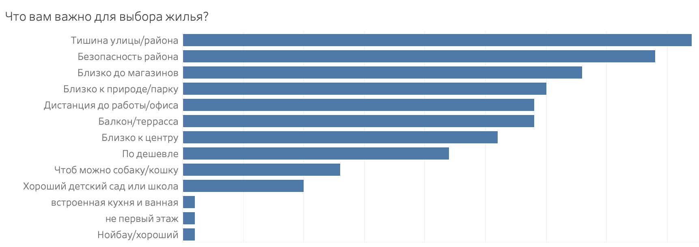
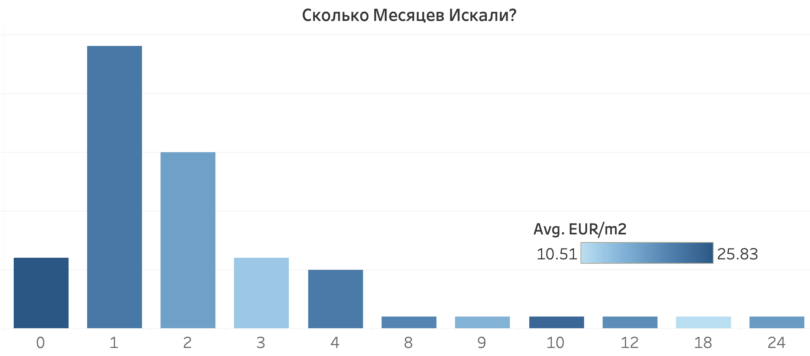
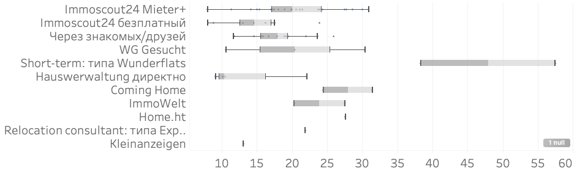

# Как найти квартиру в Берлине в 2023

 
Найти квартиру в Берлине сложно. Почти невозможно с первого раза найти то что нужно, особенно если переезжаете из-за границы. В 2022ом году, [137 тыс.](https://www.iamexpat.de/expat-info/german-expat-news/online-meldebescheinigung-service-launch-across-germany) людей въехали в новую квартиру в Берлине и эти цифры только растут. 
# Проект
Поэтому был создан опросник где Русско - и Англоязычные новоприезжие в Берлине поделились своим опытом и помогли со сбором данных на этот ресурс. Если вы тоже хотите поделиться, это можно сделать анонимно и за 5 минут заполнив [Опросник](https://forms.gle/5p35oNprmwdeqgwj8). 
# Что искать?
Более 50% опрошенных людей хотят поменять жильё и это намёк на то что выбор первичного жилья был изначально неверным. Чтобы не попасть в эту ситуацию, надо ознакомиться с факторами которые оказываются важными для людей на личном опыте, обычно после подписки контракта.
## Важные факторы

1. Большинство людей сказало что хочет тишины. Для этого надо избегать квартир рядом с большими улицами и больницами. Так же искать подальше от центров и точно подальше от больших дорог. Из личного опыта, если на вашем перекрёстке проезжает трамвай и особенно если поворачивает, вы никогда не привыкнете к этому шуму. Можно так же ознакомиться с [картой шума в Берлине](https://www.berlin.de/umweltatlas/en/traffic-noise/noise-pollution/2022/maps/artikel.1327941.en.php)
2. Безопасность района. Я перевёл на Русский и на [карту криминальную статистику Берлина](https://public.tableau.com/views/CrimeStatsinBerlin2022v2/Dashboard1?:language=en-US&publish=yes&:display_count=n&:origin=viz_share_link) за 2022 год. Тут вы сами можете выбрать хочется вам чтобы у вас украли велосипед (в центре) или машину (за городом). 
3. Близость к магазинам, просто. Чем ближе к центру, тем их больше, и наоборот. Но в городе преимущественно более дорогие магазины как Rewe и Edeka, а ближе к окраинам есть более дешёвые как Kaufland, Aldi, и Нетто. Так же для тех кто скучает по товарам из СНГ, есть дешёвая сеть магазинов LEDO, в которых можно найти и творог и селёдку и икру за не импортные цены. 
4. Ближе к природе: дальше от центра. Всё то же логично. Как правило, вокруг Берлина везде природа, но на Южной части не так красиво. Для любителей парков, рекомендую жить рядом с:
- [Vpark Fshain](https://maps.app.goo.gl/VVsnKDP2LTDAaECH8)
- [Vpark Hshain](https://maps.app.goo.gl/Qja75dvHBiYprGax9)
- [Spark Pankow](https://maps.app.goo.gl/defeJh9tLAgcJtna7)
- Есть так же парки которые на карте "зелёные" но на самом деле покрыты бетоном и кишат алкашами, например Mauerpark, James-Simon-Park. [Tempelhofer Feld](https://maps.app.goo.gl/MiFzEAH5EZwwjvjT8) это бывший аэропорт. Его весело навестить особенно летом, но гулять там каждый день сложно себе представить. 

5. Дистанция до работы: Есть прекрасный сайт который показывает [время на общественном транспорте до любой точки Берлина](https://www.mapnificent.net/berlin/#13/52.5351/13.3185/720/52.5187/13.3875). Не очевидно и очень удобнo. 

## Описание Районов
Искать по районам, как Pankow, Mitte, PrenzlauerBerg имеет смысл, но дать описание району бессмысленно, как вы можете убедиться посмотрев на карту ниже. Даже в "любимом" районе как Prenzlauer Berg можно найти довольно непригодный для жилья уголок (Zionkirche), и наоборот даже в Moabit бывает очень даже хорошо. Вместо 12ти районов, удобнее ориентироваться по 200 почтовым кодам. 

Наводя мышкой на каждый участок можно прочитать что думают жильцы об их районе. Как видите, карта не полная. Так же справа можно выбрать параметры и посмотреть из каких районов люди хотят уехать. Вы можете помочь [заполнить](https://forms.gle/PJe2MDd97Wrw8E1S6) анонимно про свой район и квартиру и помочь всем кто ищет себе идеальное место в нашем городе.



# Где искать? 
Теперь когда у вас есть представление о том что вы ищете и где, метод поиска можно оптимизировать по цене и времени которое он у вас займёт.
## Время
Конечно правда что чем дольше ищешь тем дешевле получится, но как видно ниже, 2-3 месяца это оптимальный срок поиска за которое можно найти подешевле. Те кто хвастаются что ищут целый год, явно что-то делают не так: 

## Платформы
Самая популярная платформа: [Immo24](https://www.immobilienscout24.de/), и как ни странно, самый популярный метод поиска: её платная версия [Mieter+](https://www.immobilienscout24.de/meinkonto/premium-mitgliedschaft/). Я рекомендую взять на минимальный срок: 2 месяца и не забыть отменить подписку ровно через это время. Мне они не платили это написать, и мне даже не очень приятно что ImmoScout за такое берёт деньги, но в связи с большим недостатком жилья и огромным спросом, почти захватили весь Маркет в Берлине. Люди им платят в основном потому что они предоставляют справку о кредите: SCHUFA (которая сама по себе может стоить €30), и потому что у вас на 3 дня раньше есть доступ к объявлениям чем у бесплатных пользователей. В поиске жилья, объявление о нормальной квартире по нормальной цене "закроется" за пол часа, набрав 300+ заявок.
 и сколько месяцев в среднем каждый поиск занимает(по цвету)")

Платформы делятся на 3 типа: 
### Быстро, невыгодно, и дорого 
Тут в основном рассчитывают на тех, кому надо найти срочно жильё за любую цену и у кого ешё нет ни кредитной истории, ни прописки. Они предлагают гарантированноё жильё в почти коммуналках за бешеную цену. Но зато, они дешевле отелей. Их удобно брать если компания в которой вы получили работу готова платить за ваш переезд и проживание. Самые популярные: 
- [Crocodilian](https://crocodilian.de/moebliert-wohnen-auf-zeit-berlin/)
- [Coming Home](https://www.coming-home.com/en/)
- [Wunderflats](https://wunderflats.com/de)

Их легко найти, легко подписать коротко срочный контракт, и у них есть репутация которую они хотят сохранить, поэтому не кинут. Я бы посоветовал лучше найти через AirBnB и брать на месяц. Или если вы переезжаете всей семьёй, пусть муж или жена приедет на месяц раньше, поживёт в общаге (WG), и найдёт постоянную квартиру до переезда остальной семьи.
### Маркет агрегаторы 
- [Immo24](https://www.immobilienscout24.de/) - Самый большой и популярный
- [ImmoWelt](https://www.immowelt.de/) - Больше рассчитан на Немецкую публику
- [eBay Kleinanzeigen](https://www.kleinanzeigen.de/stadt/berlin/) - так же полезен для покупки подержанных авто и мебели, абсолютно бесплатный и тут больше scams
- [WG Gesucht](https://www.wg-gesucht.de/) - тут часто не только комнаты, но можно найти и целую квартиру
### Частные методы
- Через друзей, знакомых, и родственников конечно всегда можно избежать все неудобства. Можно так же поискать в телеграмме чат ЕЛБ в котором настоящие люди вам помогут
- Через Haurwervaltung, или фирмy, которая заведует квартирами. Тут могут помочь друзья, которые снимают у фирмы и обратятся в свою фирму заручившись за вас. Рекомендация людей которые уже "проверены" на самом деле многое значит. 
-  Если фирма платит, то скорее всего они вам найдут и квартиру, правда за те же деньги почти всегда можно найти лучше и без них. Конечно оставаться в квартире которую нашла фирма после срока когда она оплачивает аренду не советую.

Мы уже сравнили эти методы по времени поиска, а сейчас самое важное: сравнить по разбросу цен за кв.м полученную через каждый метод: 

Если у вас возникли возражения по поводу того что не стоит сравнивать агрегаты квартир с коротко срочным контрактом, а так же сравнивать ограниченные (меблированные) контракты и неограниченные, вы можете сами настроить параметры и получить от данных что вам нужно по ссылке в [Tableau](https://public.tableau.com/app/profile/todor.khristov/viz/2023mobile/Mobile?publish=yes&:device=phone).

# Что искать?
Итак, подитожим: 


- Квартира в 30ти минутах от центра на городском транспорте
- В тихом, безопасном районе, близко к парку и магазинам
- Нужно искать через Mieter+ 1-2 месяца 
- На бессрочный, не меблированный контракт, 
- По цене за кв.м в районе от €10-€25 за метр (warm). 

По средней площади в 70м2, это вам обойдётся от €700-€1750/месяц.


Цена за м2 падает с увеличением площади квартиры, то есть studio самое дорогое, 1-комнатка примерно такая же по цене потому что пользуется самым большим спросом от холостяков-айтишников. На 2-3 комнаты меньше спрос и в сумме дешевле. Для предприимчивых холостяков, снять двух комнатную и вселить соседа - очень даже разумная стратегия, если правильно выбрать соседа, конечно.
## Рост цен
Всегда есть мнение, что цены растут и часто слышим истории про Немцев которые подписали бессрочный контракт в 1990ом 100м2 за €200/месяц. На самом деле таких мало осталось и далеко не все кто раньше приехал получить такие сказочные контракты. Данные скорее показывают что растут не столько цены сколько *разброс* цен. То есть можно ешё найти приличную цену с удачей и терпением: 
 назад")

[Этот короткий опросник](https://forms.gle/PJe2MDd97Wrw8E1S6)

# Как найти?
Теперь соберём советы тех кто успешно нашёл. Надо быть готовым, надо правильно искать, и не попасть на типичные мошенничества которых к сожалению не мало.
## Документы
Сначала представим полный список: 
- Личное письмо с фотографиями
- Arbeitsvertrag: Подписанный контракт с работодателем
- Паспорт и Виза - копии
- Entgeltabrechnung: 3 квитанции о выданной зарплате
- Mietschuldenfreiheirsbesicheinigung: Письмо рекомендация от бывшего арендодателя о том что у вас нет к ним долгов. Можете скачать пример письма вот тут: [Скачать Документ](Mietschuldenfreiheitsbescheinigung.docx)
- SCHUFA: Кредит репорт, что нет долгов

Конечно если чего-то в списке у вас нет, то надо попытаться найти замену. Если нет контракта или зарплаты, покажите банковский счёт. Если нет письма он бывшего арендатора, пусть ваш бывший арендатор из вашей страны приезда подпишет (на Немецком), Schufa дают всем, даже если нет кредитной истории, будет стоять что "истории нет" что гораздо лучше, чем "история плохая". 

В принципе если вас попросят какие-то другие документы кроме этих, это должно служить красным флагом, что что-то не так. В лучшем случае какой-то придирчивый товарищ вам попался. А в худшем, вас пытаются обмануть.
## Стратегия

Мы уже видели что надо быть готовым искать хотя бы месяц. Это сложно сделать если вы уже не в Берлине, поэтому настоятельно рекомендую планировать арендовать на месяц в AirBNB или коротко срочную квартиру и уже искать отсюда. Заранее найти и подписать качественный договор: это практически неслыханно. 

Если ищете как большинство, через Immo24, то надо:
1. Каждый день или пару раз в день искать и посылать стандартное письмо на Немецком: 
- Нам очень нравится
- У нас такая зарплата
- готовы брать сразу
- когда можно увидеть? 
- Хотим там жить долго
- Мы пара/семья (Немцы это любят потому что меньше риска)

Написать придётся 70-100 раз, из которых вам ответят 10, а посмотрите вы всего 2-3 квартиры. 
2. Как только вас приглашают, берите все распечатанные документы и идите на просмотр. Бывает что вы придёте и там стоит очередь из таких же как вы. Это вполне нормально, просто значит что ваши шансы снижаются, но кому-то повезёт. Так же, скорее тот человек кто показывает вам квартиру не является собственником квартиры, а просто "агентом" или посредником. Его/её особо очаровывать не стоит, она просто собирает документы, а собственник будет решать. Часто вы собственника даже никогда в лицо не увидите, а будете общаться с посредником из фирмы haurwervaltung. Ничего страшного.
3. Не теряйте надежды и верьте в метод. Если прямо ничего не работает и никто не зовёт, то или вам надо искать за цену повыше, или снизить ожидания. 

## Схемы скамов
Необходимо заранее знать про возможные признаки мошенничества: 
1. **Деньги вперёд**: Пока не увидели квартиру, не поздоровались с хозяином или с фирмой которая сдаёт квартиру, пока не получили подписанный контракт и сами не подписали, и часто пока не получили ключи, **не высылайте никому деньги**. Ни за "депозит", ни за "гарантию", ни за "услуги". Если вас о таком просят, вежливо объясните что без контракта и без ключей вы деньги не вышлите. Конечно некоторые "честные" хозяева могут об этом попросить, но они сами знают что не в праве и не по закону это делают. К сожалению у хороших квартир тоже бывают нагловатые хозяева, но их нужно поставить на место.
2. **Слишком хорошо чтобы было правдой**: Часто такие объявления используют слишком хорошие фотографии или слишком дёшево предлагают. Reverse image search обычно легко находит их "фотки" на сайте квартиры в где-нибудь в Таиланде. 
3. **Более изощрённые истории**: 

- Человек встретил арендодателя, в квартире, получил ключи, подписал контракт. На месте его попросили отдать часть депозита наличными. На следующий день он пришёл и увидел что замки поменяны и "арендаторы" пропали бесследно. Не надо никогда платить наличными. Только через банковский счёт. Всегда не плохо проверить имя и фамилию человека с которым вы подписываете контракт. У них как минимум должен быть Facebook и Linkedin. В этом смысле иметь дело с Hauswervaltung гораздо спокойнее и совсем не дороже "частника".
- Другой случай: Посмотрели квартиру, проверили собственника, подписали контракт, получили ключи. Но собственник сказал что, сделал ошибку в контракте и не правильно указал свой банковский счёт. Тоже мошенник. 

И так, надеюсь вам помогла эта информация и удачного поиска жилья в Берлине. Если вам понравился этот пост, пожалуйста заполните [Опросник](https://forms.gle/PJe2MDd97Wrw8E1S6) когда найдёте свою квартиру. Если ищите более подробного разбора данных из опросника, можете посмотреть на [Tableau](https://public.tableau.com/app/profile/todor.khristov/viz/2023mobile/Mobile?publish=yes&:device=phone). Успеха!

