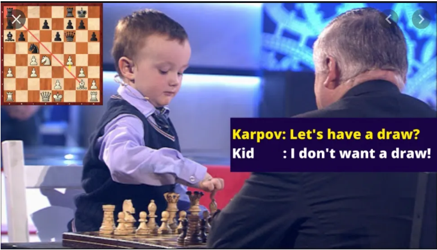
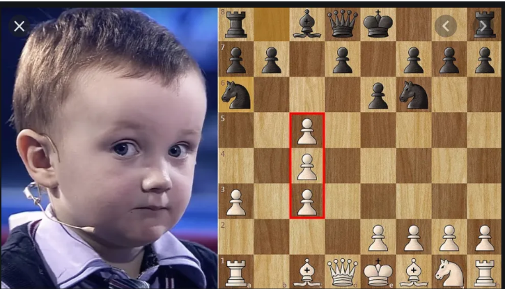

# What can chess teach about life?

At the beginning of the game, there are 20 possible moves one can make. Two for each pawn, two for each knight. Most of them are, more or less, good. The most common opening, E4 is widely preferred. When your opponent moves, this opens up 400 possible games. Once your opponent completes their 5th move, there are 69 trillion possible games. And we are still in “opening stage” of the game. Most games take on average 38 moves to complete. From there, the game tree complexity can reach incomprehensible figures (10^123), which is larger than the number of atoms in the universe (10^80). Yet, this many possibilities are contained on a small coffee table, represented by just 32 pieces and 64 squares.

If an anxious planner approaches chess moves the way they approach life: “To be or not to be”, projecting the reasonable second or third degree consequences of “being” and “not being” for every possible move they can make, they will quickly reach their limit. They will be stuck in an indecision pit, paralysed by the unknown which cannot be calculated by more than 2 moves forward. Lucky for them, there are some Opening Principles in chess that do not guarantee victory but generally lead to more secure and opportunistic chances.

1. Don’t move the same piece twice during opening
2. King Safety: try to castle
3. Connect the Rooks
4. Don’t move the Queen out too soon
5. Don’t push too far down into the opponent’s territory
6. Play to the center of the board

The lovers of rules and chess grandmasters have a checklist of 20+ such rules of thumb. Each rule is unweighted and optional and none of them guarantee victory. All they guarantee is that by following them you may end up seeing an advantage later in the game, depending on your opponent and luck. The list is so exhaustive that it is impossible to satisfy all the rules at once and to not satisfy at least one.

Another chess phenomenon beginners notice is that by choosing one move, they are abandoning other possible moves available to them at the time. You cannot take a move back, and once the opponent responds, the board forever changes. Committing feels like opening one door while closing five.

There are many chess-like moves in life, where the consequences of a move are not possible to predict even to the second degree:

- Should I go to college?
- Which major do I pick?
- Do I take job offer A or B?
- Which romantic interest to pursue?

Just as in chess, there are rules of thumb for life: It is generally good to go to college, to pick the partner with whom you experience fewer points of friction, to choose passion over money. At the beginning of the game (and life), the moves are limited but the decisions are straightforward. E4: go to college.

It is sometimes tempting to go for the Scholar’s mate, to go for the quick win: Becoming a doctor/lawyer and marry your High School sweetheart. If successful, this results in check-mate in 4 moves but if countered, will leave you in a sub-optimal opening situation: too focused and underdeveloped.

It is also tempting to do an opening in an original manner by moving your knight deep into enemy territory early in the game: an equivalent of dropping out of college to start a startup. In chess, one would then need to rush other pieces to protect the knight, while in life the dropout must quickly learn management, finance, programming, and org psychology without letting go of the CEO position as the company grows.

In one chess game, 15 moves deep, I was down a point and almost every move I could make would result in a sub-optimal situation. Thinking through my top 4 moves, each would result in me trading pieces or a blocking a key attack path. I searched for any miraculous or non-obvious combination until I started to forget my initial move analysis. I was stuck, and so I made a throwaway move. Moving a pawn forward to nowhere for no reason.

I lost more points in the next 4 moves, but that pawn ended up being the key piece that put a checkmate in place for me to win. When I moved it I didn’t see that far ahead. When I started losing, I thought the pawn was in a bad place. But due to the astronomical number of possibilities chess creates, it somehow ended up being in the right place at the right time.

Likewise, in life I am paralysed by decisions often. There are times when no option seems optimal and trying to predict second- and third- level consequences of my actions paralyses me even more. Unknowingly, I was following an old chess adage:

>when you don't know what to do, just improve your worst-placed piece. Don't try to find some miracle turnaround check mate, just do one small thing which can make your life better vs. inaction or a throwaway action.

To tie it back to life: Chess strategy is like your values or your general rules for life, tactics are your decisions.

Decisions are made for a clear, known benefit: interview for the job, get the job.

Values or rules are taken not because you know the benefit they will garner but because you believe they will lead you in the generally right direction and open up more clear decisions in the future. So when you have no clear decision, fall back on your values and improve your worst-placed piece in line with your values. e.g "rooks are generally good on open files, so I will move my rook to an open file." "helping others generally has good outcomes for all, so I will case my friend even if I don't have an interview."

*Appendix*
For those curious about some other allegory-worthy chess strategies:

1. Value your pieces correctly: Pawn: 1pt, Queen: 9pt, Rook: 5pt, Bishop/knight: 3pt. 
2. Don’t trade pieces when down in points
3. Put Rooks on open files and the Bishops on long diagonals
4. Knight on the rim is grim
5. Don’t double Pawns

