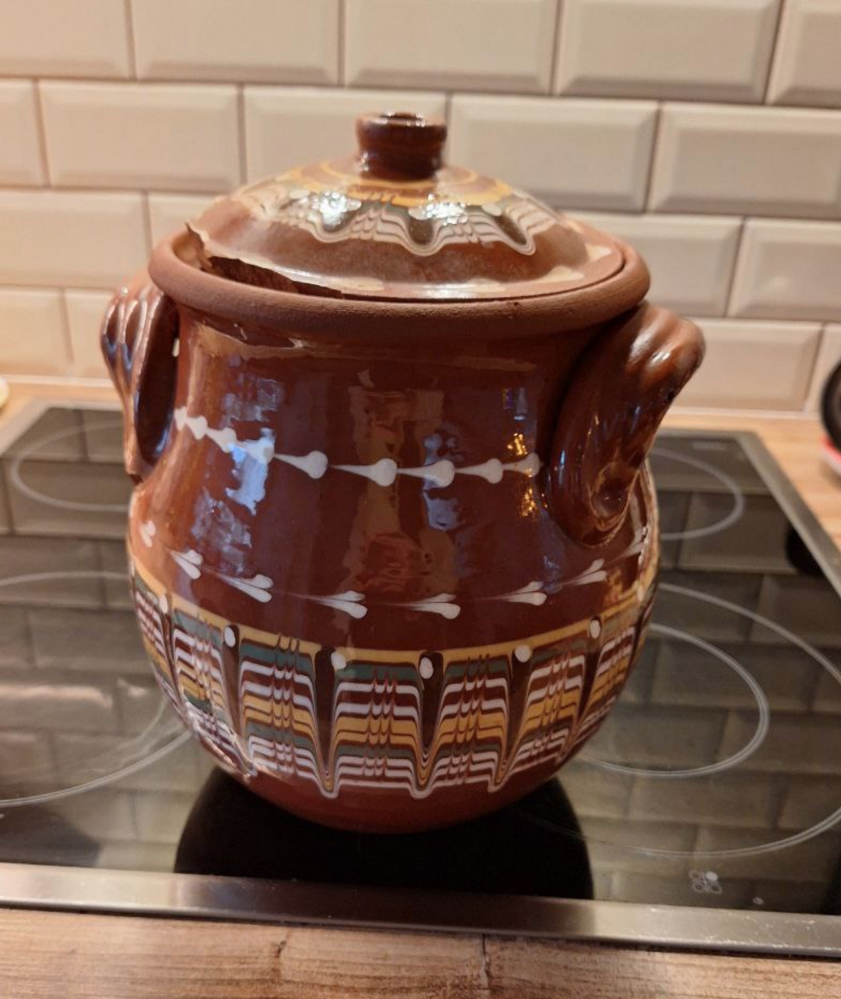
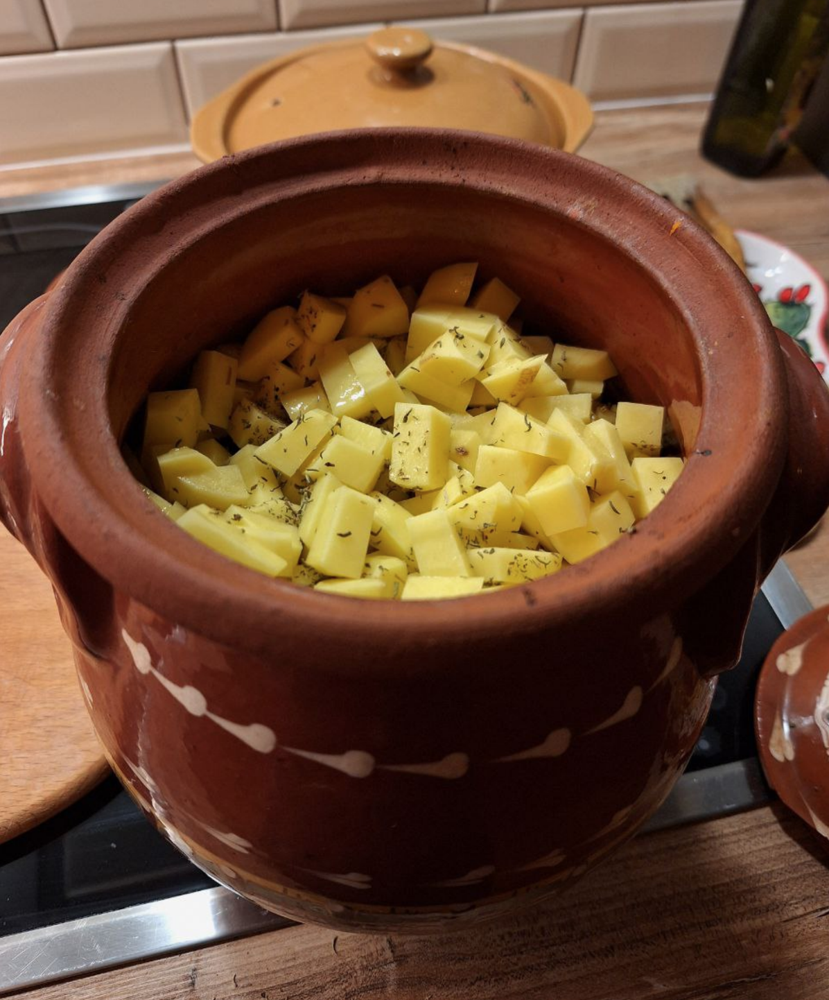

# Рецепт Болгарского Гювеч

# Болгарское Национальное блюдо: готовим дома #
Гювеч: полезное, вкусное, и лёгкое в приготовлении блюдо которое является традиционным Болгарским рецептом. На самом деле его варианты есть в других около-Черноморских культурах: Украинское Жаркóе, Грузинское Чанахи, Татарский Азу, и Персидская Яхния. Тут мы разбираем именно Болгарскую традиционную версию. 

# Горшок #
Лучше купить специально для таких блюд: Просто глиняный горшок, с крышкой с дыркой сверху для выпуска пара. Я рекомендую Литров на 5-7, чтобы кормило 4х человек, высокий, и эмалированный изнутри и снаружи. Традиционно, внутри нет эмали, но в таком случае его надо размачивать перед приготовлением, иначе он высосет воду из мяса и получится не так вкусно. 

# Продукты #
1. Мясо: 1кг телячей или свинной шеи. Выбирать с прослойкой жира как для шашлыка
2. Баклажаны: 1-2
3. Лук: 1 луковица
4. Перец красный: 2 штуки, предпочтительно который длинный и узкий, не острый
5. Картошка: 5 штук средних
6. Помидоры: 2 штуки
7. Помидоры в консервной банке, нарезанные на квадратики: 1 банку
8. Чубрец: 3-4 щепотки
9. Паприка: пол-ложки
10. Соль: 3 щепотки
11. Масло оливковое: 3-4 ч. ложки

# Метод приготовления #

1. Холодный горшок ставим в *холодную* духовку (если в горячую, то треснет при нагреве), на 220C на 10 минут чтоб разогрелся.
2. Наливаем оливковое масло, так чтобы дно было покрыто, и добавляем мелко нарезанный лук. Чуть размешиваем и в духовку на 7 мин.
3. Мясо нарезаем ломтиками каждый размером со спичечный коробок или чуть больше (но не меньше). Если нет мяса, сойдут и грибы. Когда лук поджариться, размешиваем его так, чтобы горячее масло покрывало и стенки горшка где-то до середины. Кидаем мясо по паре кусочков за раз и обязательно чтобы у него получился контакт с горячими стенками горшка и горячим маслом. Когда всё мясо в горшке, добавляем щепотку чубреца и пол чайной ложки паприки мешаем один раз и в духовку ещё на 10 мин. 
4. Достаём горшок, духовку температуру снижаем до 190C, и дальше важно слоями по порядку класть овощи сверху слоя мяса, и до конца рецепта эти слои не перемешивать!: 
- Баклажаны, нарезанные кубиками в 1см, со шкуркой, посыпать сверху щепоткой соли
- Помидоры, нарезанные ломтиками
- Помидоры из консервной банки
- Красный перец, почищенный от семечек, нарезанный дольками примерно с толщину пальца.
- Картошка, кубиками в 1см, почищенная, сверху опять чубреца щепотка. 

Лучше до верху не заполнять и оставить место для пара, примерно на столько: 

5. Закрыть крышкой и поставить обратно в духовку на 1ч15мин. 

Когда откроете, если картошка сверху пропеклась до карамельного цвета, значит готов. Если нет, то можно ещё на 15мин оставить в духовке. Гювеч сложно пережарить потому что там много воды и он скорее вариться. Когда достанете из духовки, надо дать ему пол часа постоять и остыть. А если не планируете есть его до вечера, то можно просто оставить его в выключенной духовке и он до вечера (а иногда и до утра) будет тёплый и вкусный. 

Вот и всё!

