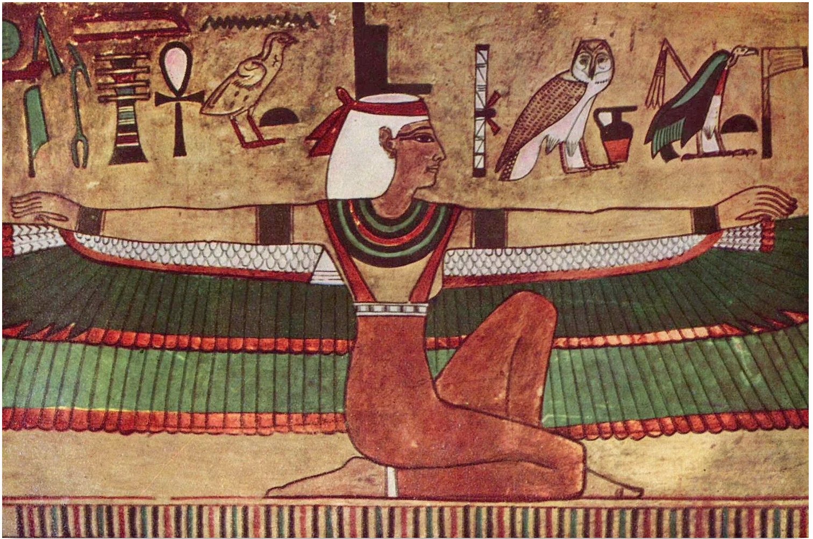

# Nessum Dorma и Значение имени



Вы смотрите последнее выступление легендарного Luciano Pavarotti на Олимпийских играх в 2006ом году. Через год он заболел и умер. В его глазах и радость и слёзы, а в голосе целый спектр эмоций. Он был оперным певцом более 50ти лет, он вернул Итальянской Опере популярность и видно что он любит петь, любит каждого кто слышит его. Может он знал что больше не споёт, может он через эту песню передавал своё прощание с любимым делом и любимой публикой.

Собственно, о чём эта песня? *Nessum Dorma*, "Пусть никто не спит", песня влюблённого *il principe ignoto* в принцессу. В opere Puccini, принцесса - китаянка Турандó, хотя в оригинальной повести Персидского поэта Низами Ганджави принцесса - Славянка по имени Назрин (Дикая Роза). 

# Четыре загадки Назрин
Принц сразу увидел что Назрин высоко образованна и мудра и сказал что скорее брак будет для неё оскорблением. Она в ответ заточилась в замок под охраной и намекнула что если он разгадает четыре загадки, она выйдет за него замуж. 

1. Она прислала ему две жемчужины и сказала сколько они весят. В ответ Принц прислал ей три жемчужины с таким же весом как две её. 
2. Она раздавила все пять жемчужин в порошок и смешала с сахаром и порошок прислала ему. Он залил порошок молоком и попросил её его выпить, потом взвесить осадок, чтобы убедиться что вес 5ти жемчужин остался. 
3. Она прислала ему перстень. Он оставил его себе и прислал ей большую жемчужину.
4. Она нашла у себя точно такую же и он отправил ей дешёвую голубую бусинку

В поеме Низами, Назрин и Принц после этого женились, а в Опере Turnadot принцесса всё равно отказала принцу и тогда он сказал ей "если ты до утра отгадаешь моё имя, то можешь меня казнить, а если нет, то женимся". Turnadot, сопротивляясь, приказала никому из слуг не спать пока они не узнают имя Принца и если не узнают до утра, будут казнены. И вот, он сидит ночью и поёт *Nessum Dorma*

    Никому не Спать! Никому не спать!
    Ты тоже, о Принцесса,
    в своём чертоге хладном
    смотришь на звёзды —
    в сияньи их мерцают любовь с надеждой…

    Но мой секрет сокрыт во мне,
    им моё имя не узнать, о нет!
    У твоих уст его скажу,
    когда рассветный луч сверкнёт!
    Мой поцелуй молчание расплавит,
    даря тебя мне.

    Хор
    Нам его имя не узнать…
    И нам придётся умереть, увы!

    Принц
    О ночь, развейся! Пропадайте, звёзды,
    пропадайте, звёзды! С зарёй мне побеждать!
    Побеждать! Побеждать!

# Четыре разгадки

Если диалог Принца с Назрин так и не понятен, то я постараюсь объяснить. В отличие от загадок в Западных сказках, где понятно что проверяется ум, сила, богатство, любовь, в Арабских сказках немного более утончённо. Загадки принцессы: скорее приглашение Принца обсудить важные темы их будущего брака, и оценить его характер, а так же его духовный настрой. Тут нет угрозы смерти или призвания к самопожертвованию. Мы помним что Назрин мудра, независима, и в принципе не нуждается в браке. Она не хочет подчиниться мужу сильнее её, но так же не хочет выйти замуж да более слабого чем она сама.

1. Назрин отправила ему две жемчужины и назвала их вес. Чётные цифры в древнегреческой культуре означают женский пол. Принцу надо было отправить обратно нечётное количество жемчужин, но он аккуратно смекнул что его одна или три не должны превышать её две. Таким образом он обозначил что его контрибуция к браку равна её.

2. Она растёрла жемчуг в пыль и добавила сахар, как бы спрашивая, а как отделить белую жемчужную пыль: их мир и любовь, от белого сахара, любовной страсти, наслаждения? Не путает ли Принц страсть с любовью? Разбавив пыль молоком и предложив ей выпить его, он сказал что страсть пройдёт, но любовь не уменьшится ни на унцию. 

3. Послав ему свой перстень, она сказала что "ты удовлетворил её и вот получай то что ты хотел". Отправив ей жемчужину обратно, он показал что не нужно ему платы и он отдаст больше чем заберёт. 

4. Найдя такую же жемчужину и соединив их вместе, она показала что "вот мы как одно, что к этому можно ещё добавить?". Он добавил никчёмную бусинку, как бы говоря: ничто не может сравниться с той красотой которая у нас получилась. 

# Значение Имени

В чём суть имени? Сегодня мы даём наше имя каждому встречному, при пожатии руки на бизнес встрече, в каждом Starbucks, с посылкой каждого е-майла. Но, например, много людей в Facebook нарочно исказили себе имена, и в instagram и telegram мало кто использует своё имя в @tag. Что-то всё-таки есть в страхе что наше имя попадёт кому-то, кому оно не предназначено и я уверен что эта боязнь глубже чем страх финансового мошенничества.

Иероглифы выточены в саркофаг Фараона 4000 лет назад, история про падение бога Ра может помочь нам разобраться в источнике этой боязни. 

 Copyright Osama Shukir Muhammed Amin")

Ра, создатель неба и земли, воды, жизни, богов и людей, птиц и зверей и рыб и себя самого. У него много имён, но его Имя никто не знал и не может знать. 

Исида, умная женщина, непокорнее миллиона мужчин, с большей властью чем миллион богов и страшнее чем миллион духов. В отличие от Ра, которому всё равно, ничего не скрыто от неё ни на земле ни на небе, ни в преисподней, которую она создала. В своём сердце она решила узнать имя светлого бога. 

Каждый день Ра выходил перед свитой и садился на трон горизонта. Исида слепила из его слюны и земли змею и оставила её на дороге по которой Ра проходил между днём и ночью. 

Ра со своей свитой богов Жизни, Богатства, Здоровья прошёлся по дороге как обычно и змея укусила его. Огонь загорелся в его лесу и он закричал 

     -"Боги Жизни, Богатства, Здоровья!, что это?" 
     -"Что?! Что?!" -ответили они. 

Яд залил его как затопление Нила и боль была холоднее воды и жарче огня. Настоящее имя Ра дали ему его отец и мать, но он не сказал его даже своим детям. Он созвал своих детей богов, но никто из них не смог ему помочь. Потому что только тот кто сделал заклинание, может его снять. Исида пришла тоже. Она спросила у него, притворяясь что не знает, не укусила ли его змея, одна из его творений. Если так, то пусть он скажет ей своё имя и она его сможет вылечить. 

    -"Я творец неба и земли, строитель гор, творец воды, коров и быков, 
    когда я открываю глаза- день, а закрываю- ночь. 
    Я творец времени, дня, времён года, огня жизни. 
    Я Утро, День, и Вечер" - Сказал Ра
    -"Но ни одно из них не твоё настоящее Имя" - Сказала Исида

Ра пришлось шепнуть своё настоящее имя Исиде, и яд покинул его, как она обещала. Но с тех пор он перестал быть великим богом и отдал свою власть и оказался в услужении у Исиды.

В Библии, в Ветхом Завете, и в Торе, Моисей и многие другие пытаются тоже узнать имя Бога, но никто не получил ответа. Только в Новом Завете, Бог сам связал себя сказав что его Имя - Любовь. 

# Что же стало с Принцем?
В конце, он женится на принцессе. В Опере Puccini, principo ignoto раскрывает ей своё имя сам, и так разрешает парадоксальное желание Принцессы с одной стороны не быть ни у кого в подчинении и одновременно быть в союзе с достаточно сильным и умным мужчиной. 

В версии Ганджави, Принц не кладёт голову под меч и даже не загадывает своей загадки. Его ответы на её загадки дали Принцессе достаточно, чтобы представить себе их будущее. 

Ссылки:

- [Перевод с Египетских иероглифов про имя Ра 2055 BC, оригинал](https://www.ucl.ac.uk/museums-static/digitalegypt/literature/isisandra.html)
- [Научная Диссертация про Загадки Турнадо](What_does_Turandot_want_From_Puccinis_Fr.pdf)

