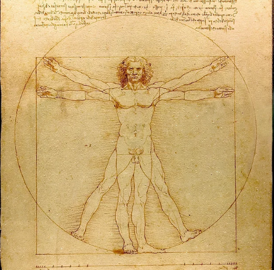

# Платон как анти аристотель

homo Deus

Аристотель сказал что человек познаёт себя через его чувства и импульсы, с помощью наблюдения себя извне, человек должен быть способен узнать не только свои хорошие но и плохие качества и их исправить. Такая форма мета анализа присутствует во фразах «Посмотри на себя со стороны» или «закрой глаза и наблюдай за своими мыслями, как они проплывают мимо тебя» (в случае медитации). Самоанализ эффективно помогает нам правильно вести себя в обществе, направлять курс образования и карьеры. Это мощный инструмент выживания и служат компасом который приведёт к спокойствию. Чувства голода, холода, и неудобства дают нам импульс мгновенно улучшить ситуацию. И так, в действиях человека, Аристотель советует: самое важное прагматизм: сделай хорошо для себя и ты сделаешь хорошо для мира. 

	Но Аристотельский метод не достаточен чтобы ответить на вопросы души и призвания. Попытка познать мир через чувства и личные ощущения толкает человека к недалёкой от него точке беспомощности. Ведь наши чувства примитивны: Наш нос в 10,000 хуже собачьего, наши глаза видят всего лишь одну миллиардную часть всего светового спектра. Большинство того что мы «знаем» находится только в нашем воображении (что земля круглая и вертится вокруг солнца, что в наших клетках ДНК). Да, мы полагаемся в этих знаниях на наблюдения учёных но мы сами никогда не сможем ощутить их ни чувством ни импульсом и выбираем именно верить в их существование так же как древние люди верили в идолов, подтверждаемые шаманскими доводами основанными на языческой системе мира. А в данном случае, вопросы перед каждым человеком куда сложнее чем форма земли: Кем быть? Как жить? Как не страдать? Как любить? На эти вопросы есть много ответов, но мы ищем не просто ответ а самый оптимальный из них. А как определить самый оптимальный путь не зная всех других путей одновременно? 

И так, старательный человек придерживавшийся принципа «попробуй, посмотри» довольно быстро приходит в тупик и часто осознавая свою беспомощность перед высокой проблемой самореализации, ищет методы смирения со своей беспомощностью. Один из методов смирения: Таоизм и Буддизм которые призывают  «отдаться течению» и обрести силу в знании что мир непознаваем. В экономике подобный подход называют «невидимой рукой рынка», а в мемах часто выражается как «отпусти то что хочешь иметь и оно к тебе придёт» или «попроси у вселенной и она тебе даст». 

	Наши чувства это выражение нашей человеческой природы. Природа всегда стремится к equilibrium , к равновесию приливов и отливов, восхода и заката солнца, замерзания и оттепели чтобы в сумме осталось стабильность а не прогресс. Посмотрите на лес который не менялся в сущности миллионы лет хотя внутри его происходило постоянное возрождение и гниение. Так же и наши чувства это меч о двух концах, гарантирующий в сумме постоянство. Потакая им мы можем с такой же вероятностью улучшить и ухудшить нашу жизнь и это не дефект а принцип их действия. Потакая голоду мы можем насытится а можем располнеть, искра возбуждения может привести к любви или к страданиям, а желание отдохнуть ведёт к приливу сил или застою. 

imago viva Dei

Человек, в его стремлении не оставаться в equilibrium, вопреки природе смог затупить ту сторону чувств которая ведёт к возвратному процессу в постоянство и таким образом за свою короткую жизнь может продвинуться гораздо дальше чем запланировано было природой. Как клапан сердца который даёт крови хлынуть вперёд но закрывается когда она устремляется назад, человек создал правила по которым только возвышенные желания получают ресурс и свободу реализации. Именно через отдачу себя позитивным порывам и проявлению силы воли в сопротивлении их обратной стороне человек способен стремится к познанию себя. Познанию себя не как учёный-наблюдатель, а как как дерево даря кислород и плоды всем нам, не наслаждается ценой своего подарка, а получает от нас взамен тот необходимый углекислый газ из которого создана каждая молекула его ствола, листьев, и корней.

Платон утверждает что путь познания себя: через творчество. При том чтобы творить не обязательно сначала превратиться в уберменша, с идеальной диетой и полным мастерством над своими мыслями и инстинктами. Не обязательно познать себя или даже представить как ты выглядишь извне. Достаточно быть чистым сосудом и источником любви. Творчество происходит из человека, из глобальной силы любви в смысле Конфуция которую он называл Йен. Эта любовь к правде, к красоте, и к человечеству. Творчество бескорыстно так же как и любовь но чтобы творить, надо навести порядок в своих импульсах и обуздать обратное остриё их меча. Для этого надо поверить в то, что под слоем потакания слабостям и искушениям кроется настоящее сокровище.  

 Оба Конфуций и Платон постулировали что человек изначально хороший и источник хороших побуждений находится в нём самом. Отличие между людьми лежит в их способности соблюдать фундаментальные законы чести. Знаменитые слова Пушкина отлично подчёркивают этот концепт: «береги честь с молоду». Эти законы во всех религиях почти одинаковы и заложены изначально внутри человека но постоянно должны быть соблюдены чтобы любовь в каждом из нас не затемнялась нашими плохими мыслями и поступками. Жизнь человека с чистой совестью сама по себе посвящается чему то большему чем он сам. Как минимум большему чем прагматизм а в идеале играет роль умножителя любви вселенной через творчество и дела которые всегда имеют вид воплощённой и осознанной мысли. 

